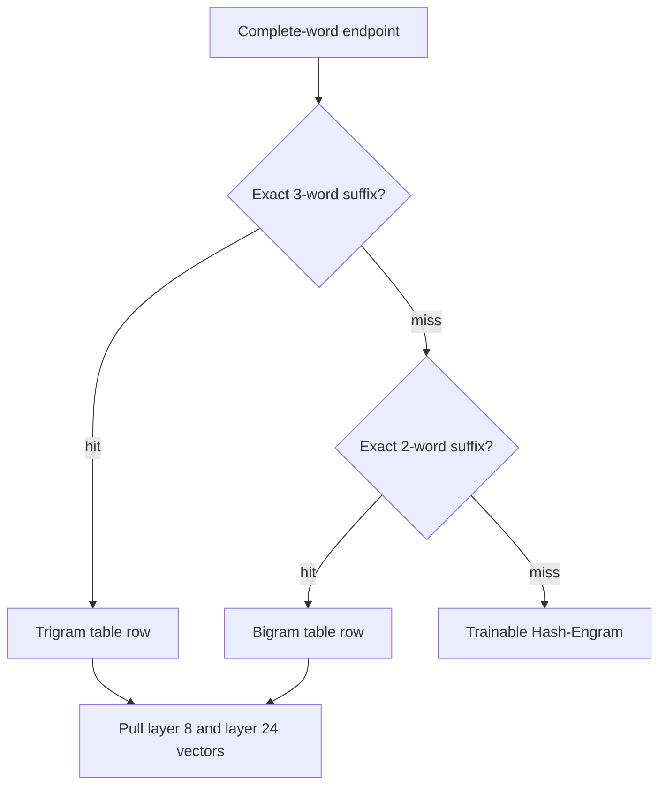
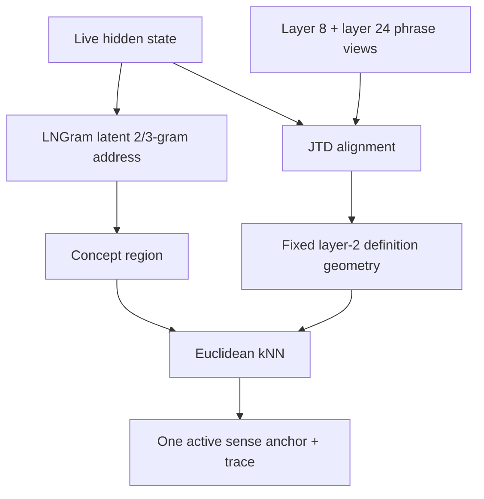
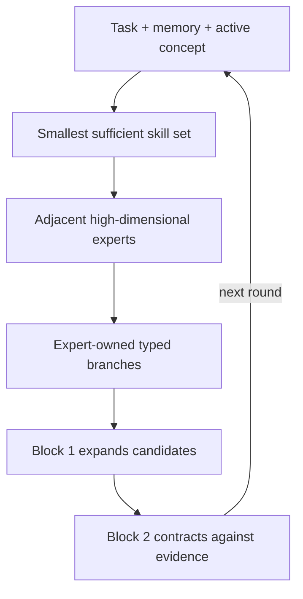

# Dendritron Recurrent Engram

<p align="center">
  <a href="docs/Dendritron_ARM_Technical_Architecture_Brief.pdf">
    
  </a>
</p>

<p align="center">
  <strong><a href="docs/Dendritron_ARM_Technical_Architecture_Brief.pdf">Read the technical architecture brief</a></strong><br>
  Two frozen phrase tables · layer-2 concept geometry · shared LoRA skills · expert-owned branches · two-block DeepLoop
</p>

## Why this architecture exists

Dendritron moves learned knowledge out of repeated dense computation and into
sparse, addressable memory. A large Qwen donor performs the expensive semantic
encoding once, offline. The live recipient then retrieves only the rows needed
for the current text and carries its changing thought through two recurrent
physical blocks on CPU/ARM.

The design has one primary systems objective:

> **Use an NVIDIA-class GPU once to construct frozen knowledge assets; run and
> train the live Dendritron through CPU/ARM memory lookup, low-rank skills,
> sparse experts, and two reused blocks.**

The architecture separates stable knowledge from changing thought:

- **Memory is the stable reference.** Exact phrase states and definition-sense
  locations preserve knowledge already learned by the donor.
- **Compute is the changing region.** Skills, experts, branches, and recurrent
  updates transform the current thought.
- **The sparse-capacity law is fixed at 25% memory and 75% conditional
  compute.** The ratio comes from the architecture's paired amplitudes `0.5`
  and `sqrt(3)/2`, whose squared magnitudes are `0.25` and `0.75`, together
  with the intended one-to-three relation between stable reference and active
  transformation. Engram results provide external corroboration; they are not
  the origin of the rule.

The DeepSeek Engram work motivates static lookup as a separate sparsity axis,
and Memory Grafting shows that frozen donor hidden states can become the values
inside an exact n-gram memory. Dendritron extends that idea with two donor
depths, a definition-concept geometry, latent LNGram addressing, reusable LoRA
skills, expert-owned reasoning branches, and a two-block recurrent engine.

Research basis: [Conditional Memory via Scalable Lookup](https://arxiv.org/abs/2601.07372) and
[Memory Grafting](https://arxiv.org/abs/2605.20948).

## The core memory mechanism: two separate Engram tables

The frozen phrase memory consists of **two independent tables**. They have
separate row numbers, indexes, shards, and manifests.

| Frozen table | Rows | Exact key | Payload in every row |
|---|---:|---|---|
| Trigram Engram | 500,000 | One exact three-word phrase | UTF-8 phrase, frequency, `layer08[2048]` BF16, `layer24[2048]` BF16 |
| Bigram Engram | 500,000 | One exact two-word phrase | UTF-8 phrase, frequency, `layer08[2048]` BF16, `layer24[2048]` BF16 |

Each phrase was sent to the donor by itself. The stored values are the donor's
hidden states at the final non-padding subtoken of that phrase:

```text
isolated phrase
  -> one Qwen forward pass
  -> final non-padding subtoken
  -> hidden_states[8]  = 2,048-dimensional BF16 vector
  -> hidden_states[24] = 2,048-dimensional BF16 vector
  -> write both vectors into that phrase's table row
```

The phrase text and IDs serve as addresses and trace metadata. The semantic
content resides in the two hidden-state vectors.

### Why two hidden-state depths are stored

| Donor state | Intended role | Live use |
|---|---|---|
| Layer 8 | Earlier lexical and compositional construction | Gives the recipient useful phrase structure before and during early recurrent processing |
| Layer 24 | Deeper composed phrase meaning | Enters the later contraction path after the live state has acquired context |

A final donor layer would emphasize the donor's output-specific summary. Layers
8 and 24 preserve two useful stages of representation that the smaller
recipient can reinterpret through its own recurrent process. Keeping the live
width at 2,048 also allows each donor row to enter without an early width
bottleneck.

## Exact lookup and hidden-state retrieval

Lookup happens at every complete-word endpoint. The router checks the longest
surface phrase first:

```text
1. Build the exact three-word suffix ending here.
2. Query the trigram index.
3. On a hit, receive (bank="trigrams", row_index=i).
4. On a miss, build the exact two-word suffix.
5. Query the bigram index.
6. On a hit, receive (bank="bigrams", row_index=j).
7. On an exact phrase miss, activate the trainable Hash-Engram path.
```

The returned row pointer then pulls both frozen vectors:

```text
bank name + row index
  -> locate immutable Safetensors shard
  -> compute local row inside the shard
  -> load layer08[local_row]
  -> load layer24[local_row]
  -> verify phrase mask and source trace
```

This is an address lookup followed by a payload read. The router never rebuilds
the hidden states during live execution.



Example: when the current text ends in `Alexander the Great`, an exact
trigram hit selects one row from the trigram table and pulls that row's layer-8
and layer-24 vectors. The bigram table remains a separate fallback address
space. Lower-order rows may also be exposed for decomposition experiments,
while the default injection follows longest-match priority.

Punctuation stays in the live Qwen token stream. Frozen phrase lookup uses
complete-word boundaries: `tree bark,` can retrieve `tree bark`, while a comma
between the words starts a new phrase segment.

Research basis: Memory Grafting supplies frozen final-token donor values and
longest exact suffix lookup; DeepSeek Engram supplies deterministic conditional
memory and hash-based miss coverage. Dendritron's extension is the separate
500k/500k word-phrase inventory with two donor depths per row.

## What happens to the two retrieved vectors

The selected phrase row produces two live payloads:

```text
layer-8 phrase vector
  -> JTD layer-8 map
  -> layer-2 joint concept frame
  -> projected movement into the initial and early recurrent state

layer-24 phrase vector
  -> JTD layer-24 map
  -> the same layer-2 joint concept frame
  -> projected movement into Block 2's later contraction path
```

The current reference code injects the layer-8 view at initialization and on
recurrent visits. It exposes the layer-24 view in physical Block 2. Small
trainable gates begin near zero so the recipient learns how strongly to use
each frozen donor view.

Relevant files:

- [`dendritron/retrieval.py`](dendritron/retrieval.py): longest `3 -> 2 -> 1` routing.
- [`dendritron/jtd.py`](dendritron/jtd.py): exact surface indexes and collision verification.
- [`dendritron/engram_store.py`](dendritron/engram_store.py): row-to-shard loading of both vectors.
- [`dendritron/memory_fusion.py`](dendritron/memory_fusion.py): JTD transfer, gating, and staged injection.

## The separate concept route: LNGram, JTD, and layer-2 kNN

Phrase lookup answers: **Which stored phrase occurred?**

Concept lookup answers: **Which meaning is active in the current context?**

The definition bank is a third frozen asset, separate from both phrase tables.
Each dictionary sense owns one Qwen layer-2 vector plus exact source metadata
and ordered links to the words in its definition.

| Definition field | Function |
|---|---|
| `layer02[2048]` | Fixed concept location |
| word ID and sense ID | Lookup and trace pointers |
| exact definition | Source record |
| ordered definition-word IDs | Graph links showing how the definition is constructed |

The intended live concept resolver is:

```text
evolving hidden state
  -> LNGram projection
  -> hard latent 2/3-gram symbol address
  -> concept region / candidate neighborhood

live state + retrieved layer-8 vector + retrieved layer-24 vector
  -> separate JTD maps
  -> fixed Qwen layer-2 definition geometry
  -> Euclidean k-nearest-neighbor search inside the routed concept region
  -> one active definition-sense vector and its source trace
```

LNGram makes the concept address repeatable without depending on surface token
identity. JTD aligns unlike vector sources into the same concept geometry while
leaving every layer-2 definition vector at its original donor location. The
Euclidean neighbor step chooses the meaning that the current context actually
occupies. For a polysemous word such as `bark`, the tree sense and dog sense
remain separate points; the live state resolves one active sense.



Words, token IDs, sense IDs, and definition-word IDs remain outside the vector
coordinates. They locate and explain the retrieved point; the point itself is
the learned concept geometry.

Research basis: [Lngram](https://arxiv.org/abs/2605.24869) supplies hidden-state
discretization and exact latent n-gram lookup. [Locality Preserving Joint
Transfer](https://arxiv.org/abs/1906.07441) supplies separate source mappings
into a neighborhood-preserving shared frame. Dendritron fixes Qwen layer-2
definition senses as the frame and connects the LNGram address to Euclidean
concept-neighbor retrieval.

### Current implementation boundary for concept resolution

The repository already contains LNGram lookup, separate JTD maps for layer 8,
layer 24, and the live state, and Euclidean definition weighting. The current
reference payload builder retains every exact word-sense candidate and computes
an inverse-distance field across those candidates. The target architecture
above requires the final LNGram-routed concept-region kNN executor to return one
active sense. That executor remains an explicit implementation milestone.

## Universal subspace, shared LoRA skills, and experts

These are three different forms of capacity.

| Level | Geometry | Purpose |
|---|---|---|
| Universal subspace | Roughly 16-32 principal directions in low-rank weight-update space | Common transformation structure found across successful adapters |
| Shared LoRA skills | Learnable low-rank adapters built on and beyond the universal directions | Reusable operations such as comparison, causal analysis, retrieval control, or mathematical manipulation |
| Experts | High-dimensional conditional modules outside the low-rank basis | Specialized domain/task junctions that own reasoning branches |

The universal subspace is the common coordinate system. A skill is an actual
learnable adapter operating in that system. An expert is a larger specialist
selected through skill adjacency. This separation keeps common operations
compact while preserving high-dimensional capacity for specialized work.

The geometric router seeks the smallest sufficient set of skills for the
current task. Selected skill IDs open a bounded neighborhood of adjacent
experts, so the global comparison remains small even as the expert library
grows.

Research basis: [Shared LoRA Subspaces for Almost Strict Continual
Learning](https://arxiv.org/abs/2602.06043) supports a continually refined
foundational adapter subspace and compact task coefficients. Dendritron treats
those reusable adapters as skills and places high-dimensional experts beyond
the shared low-rank foundation.

## How user learning becomes LoRA Engram memory

Learning happens in stages rather than rewriting the full model for every
interaction:

```text
1. Route the task through a small set of shared skill LoRAs.
2. Train temporary user/episode coefficients and any permitted residual skill update.
3. Record the concept IDs, skills, experts, branch outcome, and success evidence.
4. Commit a successful trace to the user's experience Engram tier.
5. Reuse that trace as a prior when the same concept-task neighborhood returns.
6. During consolidation, absorb recurring residual structure into an existing skill
   or add a new orthogonal direction when the evidence supports a genuinely new skill.
```

The experience Engram preserves personal, local adaptation. Shared skills
preserve operations that repeatedly generalize. The universal subspace changes
more slowly and only through consolidation. This provides continual learning
while keeping active updates sparse and low rank.

Experience-tier commits and consolidation are part of the target architecture;
the current repository contains their schemas and shared-subspace utilities,
with the complete per-user runtime still to be connected.

## Task -> skill -> expert -> branch -> DeepLoop

A task is the current relation to solve, such as proving a conclusion,
comparing two claims, explaining a cause, or constructing a counterfactual.
The task combines with retrieved concept evidence to activate shared skills.
Those skills restrict expert selection. Each selected expert owns its own
candidate reasoning branches.



Branches come from experts because their premises, anchors, and valid
operations depend on the expert's domain. The typed branch vocabulary is:

| Branch | Core operation |
|---|---|
| Deductive | Bind premises and test whether a candidate conclusion is jointly supported |
| Causal | Bind cause, mechanism, and effect under causal order constraints |
| Contrastive | Preserve the dimensions that distinguish competing candidates |
| Counterfactual | Change one bound condition and propagate the resulting differences |
| Abductive | Rank candidate explanations against observed evidence and contradictions |
| Analogical | Transfer a relation structure between concept neighborhoods |

Every branch returns a proposed movement of the hidden state, signed evidence,
a harmonic residual, confidence, and exact memory/source pointers.

### Where the two-block DeepLoop sits

DeepLoop wraps the entire active hierarchy.

- **Physical Block 1 expands.** It opens relevant skills, experts, relations,
  and candidate branches.
- **Physical Block 2 contracts.** It compares candidates with retrieved memory,
  opposing anchors, causal visibility, and branch evidence.
- **The resulting hidden state returns to Block 1.** Each round reuses the same
  two stored blocks, giving effective depth `2R` for `R` rounds.

The hidden state carries the thought from round to round. Engram rows remain
stable anchors. Skills, experts, and branches determine how the thought moves
relative to those anchors.

[DeepLoop](https://arxiv.org/abs/2607.13491) supports loop-aware scaling for
reused blocks. For `N = 2R` unrolled block visits, Dendritron uses
`alpha = sqrt(2N)` on the Post-RMSNorm skip path and the one-time residual
matrix initialization gain `beta = 1/sqrt(8N)`.

## Geometric attention and branch contraction

Routing and evidence use Euclidean geometry. Each branch builds a small causal
pool containing retrieved phrase vectors, the active layer-2 sense, LNGram
concept records, premises, candidate conclusions, and supporting or opposing
anchors.

For each anchor, the branch compares two masses:

```text
p = mass implied by Euclidean distance from the current hidden state
y = mass assigned by bound evidence and the branch operator
c = y - p
```

Positive `c` attracts the thought toward underrepresented supported evidence.
Negative `c` repels it from excess or contradictory mass. The harmonic residual
measures how much branch evidence remains unresolved. This is the geometric
attention mechanism: a sparse signed field over explicit anchors, followed by
recurrent integration.

The runtime geometry uses Euclidean distance for HarMax contraction, concept
neighbors, LNGram readout, and vocabulary ranking. Bilinear runtime operator
count: `0`.

## CPU/ARM execution model

The live architecture reduces GPU dependence through five linked choices:

1. Qwen hidden-state extraction is a one-time offline job.
2. Exact trigram and bigram lookup fetches only the selected rows.
3. Frozen tables can reside in CPU memory, memory-mapped storage, or an NVMe
   hierarchy with deterministic prefetch.
4. Two physical blocks are reused for additional reasoning depth.
5. Skills are low-rank and experts activate sparsely.

The PyTorch code is the semantic reference implementation. The production path
targets packed BF16/INT8 memory, quantized linear kernels, vectorized Euclidean
distance, and ARM-aware sparse row fetch.

## What exists today

Status on 3 August 2026:

| Subsystem | Status |
|---|---|
| 500k bigram and 500k trigram inventories | Reported complete; external tables are represented here by manifests and builders |
| Separate layer-8/layer-24 payloads for both phrase tables | Reported complete; the immutable payloads remain outside the public repository |
| Longest trigram -> bigram -> dictionary resolver | Implemented and tested with synthetic data |
| Row pointer -> shard -> layer-8/layer-24 payload loading | Implemented |
| Qwen layer-2 definition extraction pipeline | Implemented as a resumable builder |
| JTD source maps and fitting objective | Implemented; real-anchor fitting remains a data run |
| LNGram, Hash-Engram, Euclidean HarMax, two-block recurrence | Implemented in the CPU reference core |
| Universal/skill/expert structural route | Implemented with generic trainable expert transforms |
| One-sense LNGram/JTD concept-region kNN | Target contract specified; live executor remains |
| Typed deductive, causal, contrastive, counterfactual, abductive, and analogical branches | Target contract specified; live executors remain |
| User LoRA Engram commits and consolidation | Target contract specified; full runtime remains |
| Full real-memory training and language-quality evaluation | Experimental milestone |
| Optimized ARM runtime | Engineering milestone after reference validation |

The recorded CPU reference run in [`VALIDATION_V1.3.md`](VALIDATION_V1.3.md)
reports 61 passing tests, forward/backward execution through both recurrent
blocks, checkpoint reload, and the exact 25/75 capacity ledger. Those checks
establish structural execution. Language quality and typed reasoning remain
experimental results to earn.

## External assets omitted from GitHub

| Asset | Contract |
|---|---|
| Bigram donor bank | 500,000 rows; two 2,048D BF16 vectors per row; about 4.096 GB raw vector payload |
| Trigram donor bank | 500,000 rows; two 2,048D BF16 vectors per row; about 4.096 GB raw vector payload |
| Definition bank | One 2,048D layer-2 BF16 vector per retained sense plus source graph |
| Surface indexes | Exact trigram, bigram, and dictionary addresses with row pointers and fingerprints |
| JTD checkpoint | Layer-8, layer-24, live-to-joint, and joint-to-live maps |
| Universal directions | Per-block low-rank input/output directions and consolidation report |

Every external asset carries its source fingerprint, tokenizer revision, shape,
dtype, row count, and SHA-256 manifest.

## Repository map

| Path | Purpose |
|---|---|
| [`modal_extract_states.py`](modal_extract_states.py) | Builds both 500k phrase tables and writes layer-8/layer-24 rows |
| [`dendritron/engram_store.py`](dendritron/engram_store.py) | Loads both hidden-state vectors from an exact phrase row |
| [`dendritron/retrieval.py`](dendritron/retrieval.py) | Longest trigram/bigram/dictionary routing |
| [`dendritron/jtd.py`](dendritron/jtd.py) | Collision-safe surface index |
| [`dendritron/joint_transfer.py`](dendritron/joint_transfer.py) | Layer-2 joint concept frame |
| [`dendritron/lngram.py`](dendritron/lngram.py) | Hidden-state discretization and latent n-gram lookup |
| [`dendritron/memory_fusion.py`](dendritron/memory_fusion.py) | Staged donor-vector and definition injection |
| [`dendritron/recurrent_core.py`](dendritron/recurrent_core.py) | Two physical blocks and repeated rounds |
| [`dendritron/working_adapter.py`](dendritron/working_adapter.py) | Universal directions, shared skills, and high-dimensional experts |
| [`dendritron/expert_graph.py`](dendritron/expert_graph.py) | Task/skill/expert/branch ownership records |
| [`dendritron/capacity.py`](dendritron/capacity.py) | Fixed 25/75 conditional-capacity ledger |

## Immediate implementation order

1. Replace the current all-candidate definition field with the LNGram-routed
   layer-2 concept-region kNN resolver that returns one active sense.
2. Materialize the real phrase and definition payloads through the surface
   index and fit the JTD maps.
3. Implement one complete deductive expert branch with source trace.
4. Extend the same branch interface to the remaining five operator types.
5. Connect user LoRA experience commits and consolidation.
6. Train and measure language quality, memory utilization, loop convergence,
   CPU throughput, and peak memory.

## Reproducing the structural checks

```bash
python -m unittest discover -s tests -v
python smoke_cpu_core.py --steps 30 --device cpu
```

## Mechanism lineage

| Research source | Mechanism taken from the paper | Dendritron extension |
|---|---|---|
| [Conditional Memory via Scalable Lookup](https://arxiv.org/abs/2601.07372) | Deterministic n-gram conditional memory, tokenizer compression, hash coverage | Two exact word-phrase banks tied to grafted donor states and CPU/ARM execution |
| [Memory Grafting](https://arxiv.org/abs/2605.20948) | Offline final-token donor states and longest exact lookup | Layer 8 plus layer 24 per row, science-first 500k/500k inventories, JTD staging |
| [Lngram](https://arxiv.org/abs/2605.24869) | Hidden-state discretization and exact latent n-gram memory | Concept-region address connected to layer-2 sense geometry and skills |
| [Locality Preserving Joint Transfer](https://arxiv.org/abs/1906.07441) | Separate source projections and neighborhood preservation | Layer-2 definition bank fixed as the shared semantic frame |
| [Shared LoRA Subspaces](https://arxiv.org/abs/2602.06043) | Foundational low-rank adapter basis and continual coefficient updates | Shared adapters become skills; user experience becomes LoRA Engram memory |
| [DeepLoop](https://arxiv.org/abs/2607.13491) | Stable scaling for repeatedly visited physical blocks | Complementary expansion/contraction roles around expert-owned branches |
| [Collision-Free Hot-Tier Extension](https://arxiv.org/abs/2601.16531) | MPHF hot tier, fingerprints, collision and gating diagnostics | Exact frozen phrase rows, verified address buckets, and separate trainable miss memory |

The original Dendritron notes supplied the architectural starting point and the
CPU/ARM objective. This repository records Ryan Carson's synthesis, extensions,
reference implementation, and the remaining experimental boundary.
