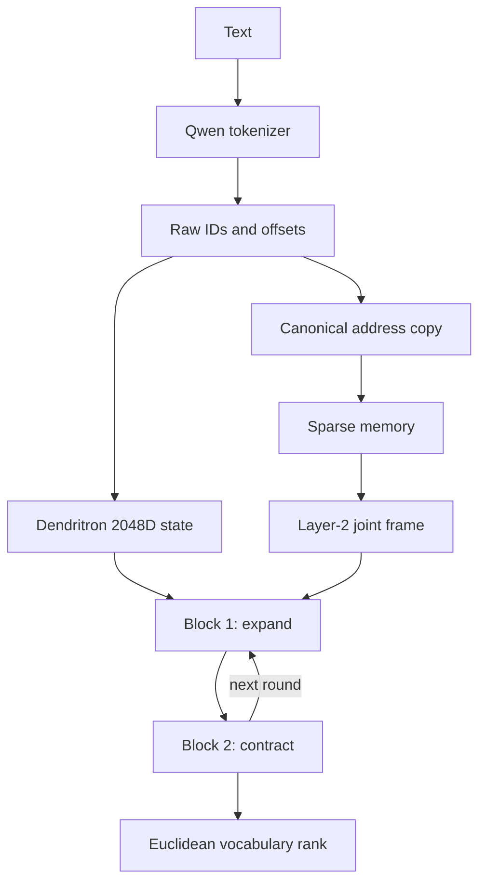

# Dendritron-ARM

<p align="center">
  <a href="docs/Dendritron_ARM_Technical_Architecture_Brief.pdf">
    
  </a>
</p>

<p align="center">
  <strong><a href="docs/Dendritron_ARM_Technical_Architecture_Brief.pdf">Read the 19-page Technical Architecture Brief</a></strong><br>
  Memory grafting · concept geometry · shared LoRA skills · expert-owned branches · DeepLoop · CPU/ARM
</p>

> **Start here.** The illustrated brief explains the full intended architecture,
> why each mechanism was selected, how the research papers support each section,
> and the precise boundary between the runnable structural core and the remaining
> semantic-branch implementation.

## Technical Architecture and Current Build Status

Architecture revision: 2026-08-03

> The original Dendritron notes supplied the architectural starting point and
> the CPU/ARM objective. This repository records my technical interpretation,
> extensions, implementation work, and the remaining engineering boundary.

Dendritron-ARM is a CPU/ARM-first recurrent language architecture that separates
stored knowledge from active reasoning. A large Qwen model produces frozen
knowledge assets during offline preparation. The live recipient retrieves those
assets sparsely, carries its changing thought through two repeatedly executed
physical blocks, and applies universal directions, shared skills, and
high-dimensional experts as distinct operation layers.

The repository currently contains a runnable structural core and the offline
asset pipelines. The full research model reaches its next meaningful milestone
when typed reasoning branches, real memory assets, fitted joint-transfer maps,
and corpus training are connected end to end.

This README is the current entry point. The versioned change files preserve
development history, and [DENDRITRON_MASTER_SPEC.md](DENDRITRON_MASTER_SPEC.md)
contains the longer design ledger.

## Architectural Contract

- **Primary objective:** live training and inference on CPU/ARM. CUDA is confined
  to one-time offline Qwen donor extraction.
- **Live symbols:** the locked Qwen tokenizer supplies raw input and output IDs.
  Dendritron owns the learned token-embedding and tied output table.
- **State width:** the first production recipient uses a 2,048-dimensional live
  state so the donor memories enter without a width bottleneck.
- **Thought:** the evolving 2,048D activation passes through two stored physical
  blocks for \(R\) rounds. Stored depth is 2; effective depth is \(2R\).
- **Memory:** frozen bigram, trigram, and definition-sense banks provide explicit
  knowledge. Hash Engram and LNGram provide trainable conditional memory.
- **Geometry:** context contraction, memory locality, and vocabulary ranking use
  ordinary Euclidean distance. HarMax supplies signed attraction and repulsion.
- **Operation hierarchy:** 16-32 universal LoRA directions form the common
  foundation; learnable shared skill adapters extend it; high-dimensional
  experts specialize outside the low-rank basis.
- **Capacity law:** scalable conditional capacity is fixed at 25% memory and 75%
  conditional compute.
- **Reasoning operators:** deductive, causal, contrastive, counterfactual,
  abductive, and analogical branches belong to experts and execute through
  explicit HarMax pools.

In one line:

> Frozen memory supplies stable knowledge; two recurrent blocks carry the
> developing thought; universal directions, skills, and experts determine how
> that thought changes.

## System Overview



The tokenizer, memory address, concept, activation, and operation spaces remain
separate:

| Space | Representation | Function |
|---|---|---|
| Surface stream | Raw Qwen IDs, UTF-8 spans, punctuation, offsets | Exact input and output identity |
| Memory address space | Canonical Qwen IDs and complete-word suffixes | Collision-checked phrase lookup and Hash-Engram addressing |
| Joint concept space | Frozen Qwen layer-2 definition geometry | Shared reference frame for senses, phrases, and live states |
| Live activation space | \(H\in\mathbb{R}^{T\times 2048}\) | The thought carried through the two-block loop |
| Weight/operation space | Universal directions, skill LoRAs, expert parameters | Transformations applied to the live thought |

Surface strings, token IDs, word IDs, and sense IDs remain pointers and trace
metadata. The vectors retain geometric locations rather than storing text inside
their coordinates.

## 1. Offline Knowledge Construction

### 1.1 Phrase Engrams

A science-first corpus supplies 200 million processed tokens. Frequency and
content filtering produce two independent inventories:

- 500,000 word bigrams
- 500,000 word trigrams

For each phrase \(s_i\), the offline donor receives the isolated phrase and
stores the final non-padding token state from two depths:

\[
e_i^{(8)}
=
F_{\text{Qwen}}(s_i)_{\text{last}}^{(8)}
\in\mathbb{R}^{2048}
\]

\[
e_i^{(24)}
=
F_{\text{Qwen}}(s_i)_{\text{last}}^{(24)}
\in\mathbb{R}^{2048}.
\]

Each row therefore contains:

```text
surface_utf8
frequency
layer08[2048] BF16
layer24[2048] BF16
```

Bigram and trigram rows keep independent row spaces, manifests, and indexes.
Exact UTF-8 phrase text is the permanent identity; tokenizer IDs are compiled
addresses.

### 1.2 Definition-Sense Bank

Definitions come from versioned lexical sources before Qwen processes them:

- Open English WordNet
- English Wiktionary
- MeSH descriptors and supplementary concepts

Each retained sense becomes one immutable row:

```text
sense_row
word_id
sense_id
exact_definition
ordered_definition_word_ids[]
layer02[2048] BF16
source_id
source_version
```

Qwen receives the exact definition text plus a fixed readout marker. The vector
comes from `hidden_states[2]` at the marker's final token. Layer 2 is used as a
shallow lexical/compositional concept location; the source definition and graph
edges remain attached as metadata.

### 1.3 Universal LoRA Directions

The universal subspace is fitted in weight-update space from successful LoRA
adapters targeting the same recipient operator:

\[
\Delta W_t = B_tA_t
\]

\[
\{\Delta W_t\}_{t=1}^{n}
\xrightarrow{\text{center + HOSVD/SVD}}
\{U_i\}_{i=1}^{r},
\qquad r\in[16,32].
\]

The first 16 directions form the initial common foundation. Persistent
orthogonal residual structure can expand the basis toward 32 directions during
consolidation. Definition vectors remain in the concept bank; universal
directions remain in LoRA weight space.

## 2. Runtime Memory

Phrase memory and word-sense memory operate in parallel.

### 2.1 Phrase route

At each complete-word endpoint:

\[
M_t^{\mathrm{phrase}}=
\begin{cases}
E_3(w_{t-2:t}), & \text{exact trigram hit}\\
E_2(w_{t-1:t}), & \text{exact bigram hit}\\
H(\pi(x_{t-n+1:t})), & \text{frozen phrase miss}
\end{cases}
\]

where:

- \(E_3\) and \(E_2\) return the paired layer-8/layer-24 donor rows;
- \(\pi\) is the frozen raw-ID to canonical-ID projection;
- \(H\) is the multi-head trainable Hash-Engram fallback.

### 2.2 Definition route

For every active word \(w_t\), the dictionary independently returns every
retained sense:

\[
D_t=\{d_{t,1},d_{t,2},\ldots,d_{t,S_t}\}.
\]

All sense points stay available. Context supplies continuous locality weights
inside the joint frame:

\[
\omega_{t,s}
=
\frac{
\left(\|P_hh_t-d_{t,s}\|_2^2+\epsilon^2\right)^{-\nu/2}
}{
\sum_j
\left(\|P_hh_t-d_{t,j}\|_2^2+\epsilon^2\right)^{-\nu/2}
}.
\]

This lets phrase-level memory and single-word meaning contribute together. It
also preserves polysemy as geometry: context changes influence continuously
instead of deleting the unused senses.

### 2.3 Punctuation contract

- Raw punctuation remains in the Qwen input, recurrent state, and output stream.
- Frozen word-Engram lookup crosses whitespace and stops at punctuation or
  symbols between complete words.
- Trailing punctuation preserves the preceding word or phrase hit at that
  word's token endpoint.
- Internal apostrophes and hyphens remain part of the word.
- Hash Engram sees canonicalized Qwen suffixes, including punctuation classes.

### 2.4 Memory-bank roles

| Bank | Key | Value | State |
|---|---|---|---|
| Trigram Engram | Exact three-word suffix | Layer 8 and layer 24, each 2,048D BF16 | Frozen |
| Bigram Engram | Exact two-word suffix | Layer 8 and layer 24, each 2,048D BF16 | Frozen |
| Definition bank | Word and sense IDs | Layer 2, 2,048D BF16 plus source graph | Frozen |
| Hash Engram | Canonical Qwen 2/3-token suffix hashes | Multi-head trainable rows | Trainable |
| LNGram | Discretized live-state 2/3-grams | Route-partitioned trainable rows | Trainable |
| Experience tier | Successful coefficient and outcome traces | Reusable episode priors | Appendable target |

## 3. Joint Transfer Domain

The frozen layer-2 definition geometry is the numerical reference frame:

\[
P_d(d_s)=d_s.
\]

Separate learned maps place each additional source into that frame:

\[
z_8=P_8e^{(8)},\qquad
z_{24}=P_{24}e^{(24)},\qquad
z_h=P_hh.
\]

Same-content anchor pairs fit \(P_8\), \(P_{24}\), and \(P_h\) with point
alignment and locality-preservation losses. A final map \(P_{J\rightarrow H}\)
converts joint-space movement back into the recipient's live coordinates.

Two repository components have historically used the JTD name:

| Component | File | Actual role |
|---|---|---|
| Surface compiler | [dendritron/jtd.py](dendritron/jtd.py) | Builds canonical token/word addresses, exact collision verification, and row pointers |
| Numerical transfer | [dendritron/joint_transfer.py](dendritron/joint_transfer.py) | Aligns layer 8, layer 24, and live states to the fixed layer-2 concept frame |

Keeping these jobs separate prevents lookup labels from becoming vector
contents.

## 4. Euclidean HarMax Contraction

Each live query \(q\) interacts with a causally valid pool of anchors
\(\{a_i\}\). After RMS normalization:

\[
d_i^2=\|a_i-q\|_2^2+\epsilon^2
\]

\[
p_i
=
\frac{(d_i^2)^{-\nu/2}}
{\sum_j(d_j^2)^{-\nu/2}}
\]

\[
y_i
=
\frac{[e_i]_+\mathbf{1}_{\mathrm{supported}(i)}}
{\sum_j[e_j]_+\mathbf{1}_{\mathrm{supported}(j)}}
\]

\[
c_i=y_i-p_i
\]

\[
\Delta q
=
\nu\sum_i
c_i\frac{a_i-q}{d_i^2}.
\]

Positive \(c_i\) produces attraction toward supported evidence. Negative \(c_i\)
produces repulsion from excess distance mass. The harmonic cross-entropy

\[
\mathcal{R}_H=-\sum_i y_i\log p_i
\]

acts as the branch residual, and

\[
\mathrm{confidence}=(1+\mathcal{R}_H)^{-1}
\]

supplies a bounded confidence signal.

The contraction geometry is ordinary Euclidean geometry. Learnable linear maps
remain in source alignment, LoRA adapters, and expert transforms.

## 5. Two Physical Blocks Carry Thought

For round \(r\) and physical block \(k\in\{1,2\}\), the first residual sublayer
performs geometric contraction:

\[
C_{k,r}
=
\Delta_{\mathrm{context}}
+\Delta_{\mathrm{memory}}
+\Delta_{\mathrm{LNGram}}
+\Delta_{\mathrm{typed\ branch}}
\]

\[
U_{k,r}
=
\operatorname{RMSNorm}
\left(
\alpha H_{k,r}+C_{k,r}
\right).
\]

The second residual sublayer performs conditional computation:

\[
E_{k,r}
=
\Delta_{\mathrm{universal}}
+\Delta_{\mathrm{skills}}
+\Delta_{\mathrm{experts}}
\]

\[
H_{k,r}^{+}
=
\operatorname{RMSNorm}
\left(
\alpha U_{k,r}+E_{k,r}
\right).
\]

Block 2 returns \(H_{2,r}^{+}\) to Block 1 for the next round. This recurrent
state carries the developing thought; memory remains sparsely addressable at
every visit.

The intended complementary roles are:

| Block | Recurrent bias |
|---|---|
| Block 1 | Expand relations, candidate explanations, and possible conclusions |
| Block 2 | Contrast, verify, contract, and integrate supported candidates |

The stored blocks have independent parameters. Typed branch execution will make
their expansion/contraction roles explicit at the semantic level.

For \(K=2\) physical blocks and \(R\) rounds:

\[
N=KR=2R,
\qquad
\alpha=\sqrt{2N},
\qquad
\beta=(8N)^{-1/2}.
\]

\(\alpha\) scales the skip path on every Post-RMSNorm visit. \(\beta\) is a
one-time initialization gain on designated residual-branch matrices.

## 6. Universal Directions, Skills, and Experts

These are three distinct levels:

| Level | Geometry | Role |
|---|---|---|
| Universal directions | 16-32 frozen low-rank directions in LoRA weight space | Common structure shared across successful adapters |
| Skills | Learnable low-rank LoRA adapters extending the universal core | Reusable operations shared across tasks and experts |
| Experts | High-dimensional conditional modules outside the low-rank basis | Task/domain specialization and branch ownership |

An expert-conditioned update has the conceptual form:

\[
\Delta h_e
=
\sum_i a_{e,i}U_i(h)
+\sum_k s_{e,k}L_k(h)
+E_e(h).
\]

The live state selects a sparse set of skills. Skill adjacency narrows the
eligible expert set. Each expert connects:

```text
knowledge and concept IDs
task relation
shared skill IDs
typed BranchSpec records
optional coefficient prior
source and outcome traces
```

The two-block activation carries the thought. Universal directions, skills, and
experts determine the transformations applied to it.

### Current generic expert transform

The runnable core currently executes generic trainable branches:

\[
z_j=\tanh(W_{c,j}h)\odot\sigma(W_{g,j}h)
\]

\[
u_j=W_{o,j}z_j
\]

\[
q_j=\cos(u_j,e_j)
\]

\[
E_e(h)
=
\sum_j
\frac{q_j}{\sum_l|q_l|+\epsilon}u_j.
\]

This validates sparse expert selection, high-dimensional branch computation,
signed combination, recurrent integration, and gradient flow.

### Typed semantic branch target

Each typed branch will consume:

```text
operator identity
bound premise and conclusion roles
positive and opposing anchors
causal visibility mask
active skill IDs
exact memory and source pointers
```

and return:

```text
branch movement
signed evidence
harmonic residual
confidence
source trace
candidate or verified conclusion
```

The first complete executor should be deductive. The same interface then
supports causal, contrastive, counterfactual, abductive, and analogical
operators.

## 7. Fixed 25/75 Capacity Law

Dendritron treats the split as an architectural invariant:

\[
P_M
=
P_{\mathrm{phrase}}
+P_{\mathrm{definition}}
+P_{\mathrm{hash}}
+P_{\mathrm{LNGram}}
+P_{\mathrm{experience}}
\]

\[
P_C
=
P_{\mathrm{universal}}
+P_{\mathrm{skills}}
+P_{\mathrm{experts}}
+P_{\mathrm{branch\ executors}}
\]

\[
P_M=\frac{1}{4}(P_M+P_C),
\qquad
P_C=\frac{3}{4}(P_M+P_C),
\qquad
P_C=3P_M.
\]

This is a capacity-allocation law over scalable conditional memory and compute.
The two shared recurrent blocks are a fixed active substrate and are reported
separately. Hidden width, activation energy, runtime FLOPs, and wall time each
receive their own measurements.

Engram and LNGram experiments provide empirical support near the same 25/75
boundary. In this architecture the ratio is fixed by the wider memory/compute
design rather than selected as a tuning sweep.

The executable ledger lives in
[dendritron/capacity.py](dendritron/capacity.py).

## 8. Softmax-Free Output Geometry

The final state is compared with the Dendritron token-embedding table through
chunked Euclidean distance:

\[
\ell_v
=
-\frac{
\left\|
\widehat{W_oh_t}
-\widehat{E_{\mathrm{tok}}[v]}
\right\|_2^2
}{d}.
\]

Training uses a hard-negative rank-margin objective:

\[
\mathcal{L}_{\mathrm{rank}}
=
\sum_{v^-\in\mathcal N}
\max(0,\gamma-\ell_{v^+}+\ell_{v^-}).
\]

Generation can use raw-score argmax, top-k score selection, or rank-based
sampling. The current reference path implements chunked distance scoring,
rank-margin loss, and greedy generation.

## 9. CPU/ARM Execution Model

The live path uses:

- sparse CPU/disk row lookup;
- memory-mapped frozen BF16 assets;
- deterministic integer address compilation;
- bounded causal HarMax pools;
- route-partitioned LNGram tables;
- sparse skill and expert activation;
- two reused physical blocks;
- chunked vocabulary distance.

The PyTorch implementation is the semantic reference. Production deployment
then specializes the same graph with packed BF16/INT8 tables, quantized linear
kernels, vectorized Euclidean distance, and ARM-aware sparse row fetch.

Qwen weights participate during offline phrase and definition extraction.
Runtime keeps the Qwen tokenizer files, frozen donor rows, and the smaller
Dendritron recipient.

## 10. Current Implementation Boundary

Status as of 2026-08-03:

| Subsystem | Current state | Evidence |
|---|---|---|
| 500k bigram and 500k trigram inventories | Reported complete; large tables live outside this share folder | Stage-1 manifests and extraction records |
| Layer-8/layer-24 phrase donor banks | Reported complete; large tables live outside this share folder | Stage-2 extraction and shard-validation code |
| Definition-source acquisition and inventory | Pipeline coded and dependency-free tests passing | `stage3_dictionary/` and definition tests |
| Layer-2 definition extraction | Resumable pipeline coded | `modal_extract_definition_states.py` |
| Qwen canonical projection and surface index | Compiler coded; synthetic punctuation, collision, and 3/2/1 tests passing | `tokenizer.py`, `jtd.py`, `memory_pipeline.py` |
| Numerical joint transfer | Maps and fitting objective coded; real-anchor fit remains a data run | `joint_transfer.py`, `fit_joint_transfer_domain.py` |
| Hash Engram and LNGram | Runtime modules coded and tensor-tested in the recorded CPU run | `hash_engram.py`, `lngram.py` |
| Euclidean HarMax | Runtime module coded and tensor-tested in the recorded CPU run | `geometric_attention.py` |
| Two-block recurrent core | Structural forward/backward path recorded on CPU | `recurrent_core.py`, `model.py` |
| Universal/skill/expert hierarchy | Runtime structural path coded; generic expert branches execute | `working_adapter.py`, `shared_skill_subspace.py` |
| Typed expert branches | Operator records and mathematical contract specified | Next runtime implementation |
| Full corpus training and language-quality evaluation | Experimental stage | Begins after real-data integration |
| Optimized ARM runtime | Engineering stage | Follows reference-model validation |

The recorded [VALIDATION_V1.3.md](VALIDATION_V1.3.md) run used
PyTorch `2.7.1+cpu` with CUDA availability reported as `false`:

| Recorded check | Result |
|---|---:|
| Test suite | 61/61 passed |
| Tensor tests | 15/15 passed |
| Tiny optimizer loss | 0.206182 -> 0.186076 in 30 steps |
| Tiny next-token accuracy | 2.34% -> 35.16% |
| Median tiny forward latency | 15.766 ms |
| Checkpoint reload | Passed |
| Conditional capacity ledger | Exact 25/75 |

That smoke run establishes executable tensor shapes, causality, finite
distances, gradient flow, recurrent reuse, and checkpoint integrity. Language
quality becomes measurable after real memory integration and corpus training.

A packaging recheck on 2026-08-03 discovered 65 tests through the Python
standard-library runner: 50 dependency-free tests passed, and the packaging
runtime reported the 15 PyTorch tensor tests as skipped.

## 11. External Table Manifest

The shareable source folder can omit the large tables while retaining this
contract:

| External asset | Required shape or contents | Raw vector payload |
|---|---|---:|
| Bigram donor bank | 500,000 rows x two views x 2,048 BF16 | 4,096,000,000 bytes |
| Trigram donor bank | 500,000 rows x two views x 2,048 BF16 | 4,096,000,000 bytes |
| Definition bank | \(N_{\mathrm{sense}}\) rows x 2,048 BF16 | \(4096N_{\mathrm{sense}}\) bytes |
| Phrase metadata | UTF-8 surface, frequency, row, bank, shard, fingerprints | Data-dependent |
| Dictionary graph | word IDs, sense IDs, exact definitions, ordered definition-word edges | Data-dependent |
| Surface index | Canonical token tuples, complete-word keys, collision buckets, row pointers | Data-dependent |
| JTD checkpoint | \(P_8,P_{24},P_h,P_{J\rightarrow H}\) and fit manifest | Data-dependent |
| Universal directions | Per-block input/output LoRA directions and variance report | Data-dependent |

Every external asset should carry its exact source fingerprint, tokenizer
revision, shape, dtype, row count, and SHA-256 manifest.

## 12. Repository Map

| Path | Purpose |
|---|---|
| [dendritron/model.py](dendritron/model.py) | End-to-end recipient model |
| [dendritron/recurrent_core.py](dendritron/recurrent_core.py) | Two physical blocks and recurrent schedule |
| [dendritron/geometric_attention.py](dendritron/geometric_attention.py) | Euclidean HarMax contraction |
| [dendritron/memory_pipeline.py](dendritron/memory_pipeline.py) | Surface resolution and Hash-Engram activation |
| [dendritron/memory_fusion.py](dendritron/memory_fusion.py) | Phrase, definition, and hash memory injection |
| [dendritron/joint_transfer.py](dendritron/joint_transfer.py) | Numerical layer-2 joint frame |
| [dendritron/lngram.py](dendritron/lngram.py) | Hidden-state discretization and latent n-gram memory |
| [dendritron/working_adapter.py](dendritron/working_adapter.py) | Universal directions, skills, and high-dimensional experts |
| [dendritron/shared_skill_subspace.py](dendritron/shared_skill_subspace.py) | Offline shared LoRA basis and coefficient projection |
| [dendritron/expert_graph.py](dendritron/expert_graph.py) | Knowledge/task/skill/branch junction records |
| [dendritron/output_geometry.py](dendritron/output_geometry.py) | Euclidean vocabulary ranking and loss |
| [dendritron/capacity.py](dendritron/capacity.py) | Fixed 25/75 capacity ledger |
| [stage4_subspace/qwen_lora_universal_directions.py](stage4_subspace/qwen_lora_universal_directions.py) | HOSVD/SVD extraction of universal LoRA directions |
| [tests/](tests/) | Addressing, memory, geometry, recurrence, capacity, and gradient contracts |

## 13. Reproducing the Structural Checks

Python dependencies for the complete tensor suite include PyTorch 2.7+, NumPy,
and Safetensors.

```bash
python -m unittest discover -s tests -v
python smoke_cpu_core.py --steps 30 --device cpu
```

The real-data sequence is:

```bash
modal run modal_prepare_definition_sources.py
modal run modal_extract_definition_states.py --inventory-only
modal run modal_extract_definition_states.py
modal run modal_build_joint_transfer_domain.py

python stage3_jtd/fit_joint_transfer_domain.py \
  --anchors /data/dendritron-jtd-anchors.npz \
  --output /data/dendritron-jtd-projections.pt
```

The completed phrase banks remain immutable through these steps.

## 14. Immediate Engineering Milestone

The next architecture-defining implementation is one complete typed deductive
branch:

```text
premise pointers
  -> semantic role binding
  -> candidate conclusion points
  -> contradiction and support anchors
  -> causal HarMax pool
  -> signed attraction/repulsion
  -> branch residual and confidence
  -> conclusion plus exact source trace
```

Block 1 should propose several candidate conclusions. Block 2 should evaluate
them against supporting and opposing evidence, preserve the supported
conclusion, and return its trace into the next loop round.

Once this interface works for deduction, the same executor contract can host
causal, contrastive, counterfactual, abductive, and analogical pools.

The remaining integration order is:

1. Make definition-sense retrieval parallel to phrase retrieval in the live
   payload builder.
2. Implement and test the deductive branch executor.
3. Generalize the typed branch interface to the remaining operators.
4. Compile or verify the real definition bank, surface index, and JTD maps.
5. Fit the 16-32 universal directions from successful task LoRAs.
6. Train the full recipient on CPU/ARM and record memory hits, branch residuals,
   loop convergence, token rank, throughput, and peak memory.
7. Port the validated graph to quantized CPU/ARM kernels.

## 15. Mechanism Lineage

| Research source | Mechanism used here |
|---|---|
| *Memory Grafting: Scaling Language Model Pre-training via Offline Conditional Memory* | Offline donor states, final-token phrase values, longest exact lookup, lightweight projection and gating |
| *Conditional Memory via Scalable Lookup* | Canonical token projection, deterministic conditional memory, multi-head hash coverage |
| *Lngram: N-gram Conditional Memory in Latent Space* | Learned low-bit route symbols and latent 2/3-gram lookup |
| *Shared LoRA Subspaces for Almost Strict Continual Learning* | Principal LoRA factors, compact coefficients, orthogonal residuals, consolidation |
| *DeepLoop: Depth Scaling for Looped Transformers* | Two stored blocks, repeated visits, Post-RMSNorm, loop-aware \(\alpha/\beta\) scaling |
| *Harmonic Loss Trains Interpretable AI Models* | Euclidean HarMax mass, harmonic cross-entropy, and the \(y-p\) derivative |
| *Locality Preserving Joint Transfer* | Point and neighborhood preservation across source geometries |

The Dendritron-specific synthesis is the complete interaction among explicit
frozen memory, latent conditional memory, Euclidean HarMax reasoning pools,
shared LoRA skills, high-dimensional expert junctions, fixed 25/75 capacity,
and a two-block recurrent thought engine built for CPU/ARM execution.
