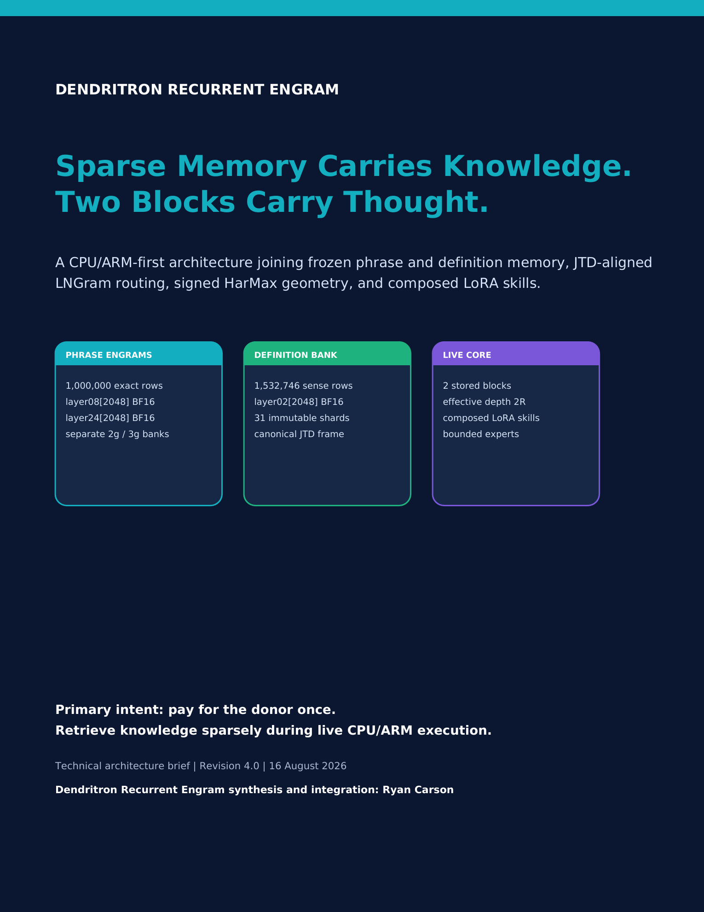
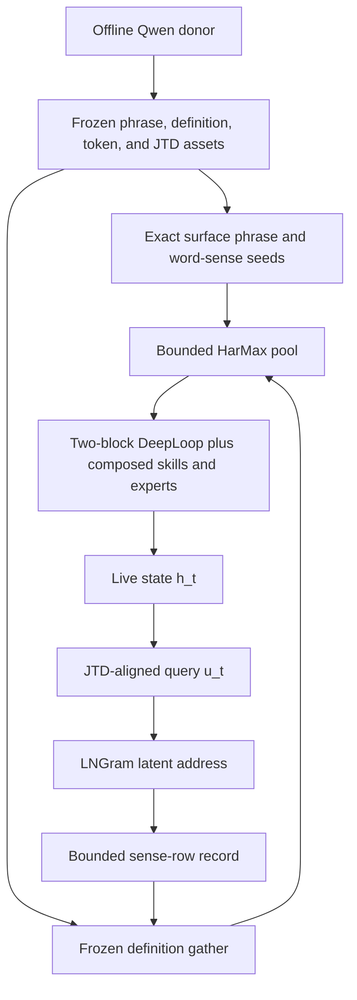

# Dendritron Recurrent Engram

<p align="center">
  <a href="docs/Dendritron_ARM_Technical_Architecture_Brief.pdf">
    
  </a>
</p>

<p align="center">
  <strong><a href="docs/Dendritron_ARM_Technical_Architecture_Brief.pdf">Read the Revision 4.0 technical architecture brief</a></strong><br>
  Sparse memory carries knowledge. Two blocks carry thought.
</p>

> **Project status - 16 August 2026:** punctuation-v2 phrase banks, token seeds,
> the layer-2 definition bank, real CPU JTD fits, and the two-block reference
> core are built or reported complete. The current development tree contains
> 176 tests. LNGram address-to-sense population and the signed definition
> HarMax field remain the next integration boundary.

## What Dendritron is

Dendritron Recurrent Engram is a CPU/ARM-first recurrent language architecture
that separates stable knowledge from changing thought:

- **Frozen conditional memory** stores exact phrase states and dictionary-sense
  landmarks produced by a large offline Qwen donor.
- **A distinct live state** carries the current problem and intermediate
  reasoning through two repeatedly visited physical blocks.
- **JTD, LNGram, and HarMax** align the live query, select a bounded semantic
  neighborhood, and convert evidence into signed attraction and repulsion.
- **Composed LoRA skills and sparse experts** provide reusable procedures and
  expert-owned typed branches.

The donor GPU cost is paid during offline asset construction. Production
inference is CPU-resident. Runtime task execution keeps the core, shared basis,
skill coefficients, private factors, experts, and router anchors frozen;
verified updates are fitted and validated offline before they are committed.

## Architecture at a glance



The definition-memory path is:

```text
h_t
  -> live_to_joint J_h
  -> joint query u_t
  -> RMSNorm(u_t) W_q
  -> exact latent 2/3-gram address
  -> populated bounded sense-row record
  -> frozen layer-2 definition gather and adjacency expansion
  -> signed HarMax (y - p) field
  -> joint_to_live
  -> gated residual into h_t
```

The raw LNGram address and dictionary row IDs are separate namespaces. JTD
owns continuous alignment; LNGram owns sparse selection; the definition bank
already occupies the canonical layer-2 joint frame.

## Frozen assets

| Asset | Shape or count | Current evidence |
|---|---:|---|
| Trigram Engram | 500,000 exact 3-word rows | Punctuation-v2 inventory complete |
| Bigram Engram | 500,000 exact 2-word rows | Punctuation-v2 inventory complete |
| Phrase payload per row | `layer08[2048]` + `layer24[2048]`, BF16 | 809,775 rows copied by exact identity and 190,225 freshly extracted |
| Qwen token seeds | `248,077 x 2,048`, BF16 | Full donor input-embedding export complete |
| Definition bank | `1,532,746 x 2,048`, BF16 | 31 frozen layer-2 shards, about 5.8 GiB, reported complete |
| JTD anchor triples | 32,768 bigrams + 32,768 trigrams | Layer-2 reference paired with layer-8 and layer-24 sources |
| Real CPU JTD fit | 65,536 paired anchors per source | `J8: 21.849 -> 0.372`; `J24: 37.923 -> 0.844` |

The bigram and trigram banks have independent row numbers, indexes, shards,
and manifests. Every phrase row stores both donor depths.

## Surface phrase memory

At each complete-word endpoint, the surface resolver uses longest exact match:

```text
exact 3-word suffix
  -> otherwise exact 2-word suffix
  -> otherwise trainable Hash-Engram miss path
```

Punctuation remains in the raw Qwen stream and in Hash-Engram addressing.
Frozen word-phrase lookup resets at punctuation or symbol boundaries while
retaining internal apostrophes and hyphens.

Phrase lookup and constituent semantic seeding coexist. Even when a bigram or
trigram wins, every complete word keeps access to all of its dictionary sense
rows. The phrase payload supplies narrow contextual memory; the constituent
senses seed the broader definition neighborhood.

Relevant implementation owners:

- [`dendritron/retrieval.py`](dendritron/retrieval.py) - longest `3 -> 2 -> 1`
  routing and lower-order decomposition.
- [`dendritron/jtd.py`](dendritron/jtd.py) - exact surface indexes and collision
  verification.
- [`dendritron/engram_store.py`](dendritron/engram_store.py) - immutable
  row-to-shard phrase loading.
- [`dendritron/hash_engram.py`](dendritron/hash_engram.py) - trainable miss
  coverage.
- [`dendritron/memory_pipeline.py`](dendritron/memory_pipeline.py) - runtime
  payload construction.

## Definition memory: JTD, LNGram, and HarMax

The definition bank stores one immutable row per word sense. Each record keeps
its exact source ID, definition text, ordered definition-word links, and one
2,048D Qwen layer-2 vector.

JTD aligns source views into that frozen frame:

- definitions use the identity reference;
- `J8` aligns layer-8 phrase memory;
- `J24` aligns layer-24 phrase memory;
- `J_h` aligns the evolving recipient state;
- `joint_to_live` is an independent movement map, initialized as identity when
  square.

LNGram forms exact discrete route addresses from the JTD-aligned live query.
A populated address resolves a bounded tensor record containing sense-row
handles, validity masks, provenance, and calibrated evidence. The model then
gathers only those frozen definition rows.

HarMax converts the gathered pool into signed movement:

```text
d_q^2   = ||u - c_q||_2^2 + eps^2
p_q     = d_q^-1 / sum_r d_r^-1
Delta u = n * sum_q (y_q - p_q) * (c_q - u) / d_q^2
```

- `y_q > p_q` attracts the live query toward underrepresented support.
- `y_q < p_q` repels it from unsupported or excess proximity.
- zero-target competitors remain in the denominator and supply contrast.

The complete bank attachment and safe gather from supplied sense rows are
reported implemented. Two contracts govern the remaining bridge:

- **O-019:** address-to-sense assignment and the hard-router training signal.
- **O-021:** construction of target evidence `y` for the definition pool.

## Two blocks carry thought

Dendritron stores two physical blocks and reuses them for `R` rounds. Stored
depth is 2; effective thought depth is `2R`.

Each block has two sequential Post-RMSNorm residual sublayers:

1. HarMax geometric, memory, and branch contraction.
2. Composed skill LoRA and expert-soma computation.

Block 1 is biased toward expansion: opening relations, candidates, and possible
explanations. Block 2 is biased toward contraction: contrasting, verifying,
and integrating candidates against memory and evidence.

DeepLoop's visit-aware scaling is retained:

```text
alpha = sqrt(2N)
beta  = 1 / sqrt(8N)
```

The expert-owned typed branch vocabulary includes deductive, causal,
contrastive, counterfactual, abductive, and analogical operations.

## Composed LoRA skills and bounded experts

For skill `s` and block `b`, one complete skill adapter is:

```text
Delta W_s,b = B_b^sh diag(q_s) A_b^sh + B_s,b^priv A_s,b^priv
```

- The shared factors are block-specific.
- `q_s` spans the full shared basis and preserves skill identity across blocks.
- Every populated skill owns block-specific private factors that read the full
  live state.
- Procedural SVD proposes and labels skill slots; it does not restrict a
  skill's input dimensions.
- `skill_to_experts` supplies the bounded candidate set. Concept evidence may
  rank that set but does not expand it.
- LNGram remains confined to definition memory and stays separate from the
  procedural skill/expert graph.

The current development tree contains 176 tests covering the broader runtime,
composed LoRA, provenance, transition capture, definition-bank attachment, and
expert-routing contracts.

## Runtime and checkpoint contract

| Phase | Contract |
|---|---|
| Offline donor construction | Qwen phrase passes, definition readouts, token seeds, and donor assets may use GPU |
| Production inference | CPU/ARM-resident sparse lookup, JTD, LNGram, HarMax, LoRAs, experts, recurrent blocks, and decoding |
| Task execution | Core, shared basis, skill/private factors, routers, and experts remain frozen |
| Verified learning | Fit a private update in an offline working buffer, then require replay, regression, version, and provenance checks |
| Canonical checkpoint | Save selected Engram/LoRA/router/expert/provenance deltas and reference immutable assets by manifest and hash |

The canonical checkpoint is an asset-referenced delta/registry commit rather
than a repeated full-model snapshot. Token embeddings, definition rows, phrase
banks, and fitted immutable projections remain stored once.

## Current implementation boundary

| Subsystem | Status |
|---|---|
| Punctuation-v2 inventories and corrected 1M phrase rows | Complete |
| Token seeds, JTD anchors, and real CPU JTD fits | Complete |
| Definition bank and supplied-sense-row attachment | Reported complete |
| Two-block HarMax recurrent core and Euclidean vocabulary output | CPU verified |
| Composed LoRA, expert, transition, and provenance tree | 176 tests reported |
| LNGram address-to-bounded-sense record population | Next integration under O-019 |
| Definition-pool target evidence and signed HarMax field | Next integration under O-021 |
| Typed branch executors, language training, and optimized ARM measurements | Experimental and engineering milestones |

`Implemented` records a completed artifact. `CPU verified` records an executed
reference module. `Reported` preserves evidence supplied by the active build
or coding-agent worktree until its exact commit and raw output are published.

## Running the reference checks

The repository uses the standard-library test runner:

```bash
python -m unittest discover -v
```

Useful focused entry points:

```bash
python smoke_cpu_core.py
python train_tiny_dendritron.py
python stage6_lngram/lngram_smoke.py
```

Large donor assets are external and referenced through manifests. The unit
suite uses synthetic fixtures where those assets are unavailable.

## Source map

- [`DENDRITRON_MASTER_SPEC.md`](DENDRITRON_MASTER_SPEC.md) - authoritative
  architecture and evidence ledger.
- [`DENDRITRON_STAGE3_6_RUNBOOK.md`](DENDRITRON_STAGE3_6_RUNBOOK.md) - staged
  asset and integration workflow.
- [`dendritron/model.py`](dendritron/model.py) - model assembly.
- [`dendritron/recurrent_core.py`](dendritron/recurrent_core.py) - two-block
  recurrent execution.
- [`dendritron/memory_fusion.py`](dendritron/memory_fusion.py) - phrase,
  definition, and miss-path residual fusion.
- [`dendritron/joint_transfer.py`](dendritron/joint_transfer.py) - JTD maps and
  joint-to-live movement.
- [`dendritron/lngram.py`](dendritron/lngram.py) - latent 2/3-gram routing.
- [`dendritron/geometric_attention.py`](dendritron/geometric_attention.py) -
  signed HarMax contraction.
- [`dendritron/working_adapter.py`](dendritron/working_adapter.py) and
  [`dendritron/shared_skill_subspace.py`](dendritron/shared_skill_subspace.py) -
  composed working LoRAs and procedural-subspace utilities.
- [`dendritron/expert_graph.py`](dendritron/expert_graph.py) - bounded
  skill-to-expert adjacency contract.

## Research foundations

Dendritron is an architectural synthesis built on published component work:

1. [Conditional Memory via Scalable Lookup](https://arxiv.org/abs/2601.07372)
2. [Memory Grafting](https://arxiv.org/abs/2605.20948)
3. [Lngram: N-gram Conditional Memory in Latent Space](https://arxiv.org/abs/2605.24869)
4. [Locality Preserving Joint Transfer](https://arxiv.org/abs/1906.07441)
5. [Shared LoRA Subspaces for Almost Strict Continual Learning](https://arxiv.org/abs/2602.06043)
6. [DeepLoop: Depth Scaling for Looped Transformers](https://arxiv.org/abs/2607.13491)
7. [A Collision-Free Hot-Tier Extension for Engram-Style Conditional Memory](https://arxiv.org/abs/2601.16531)
8. [User as Engram: Internalizing Per-User Memory as Local Parametric Edits](https://arxiv.org/abs/2606.19172)

## Credits and attribution

- **Ryan Carson:** Dendritron Recurrent Engram architecture synthesis,
  subsequent extensions, integration contracts, project ledger, and validation
  coordination represented in this repository.
- **Initial Dendritron starter and ARM package:** pre-existing foundations;
  they were not authored by Ryan Carson and are excluded from the attribution
  above.
- **Research components:** credited to the authors of the cited papers. Their
  inclusion as architectural foundations does not transfer authorship.
