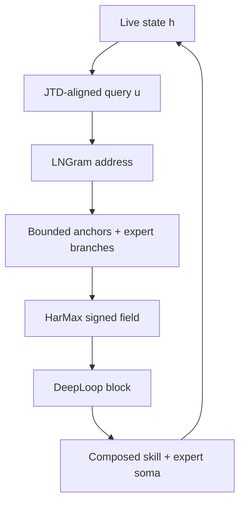

# Dendritron Recurrent Engram

<p align="center">
  <a href="docs/Dendritron_ARM_Technical_Architecture_Brief.pdf">
    
  </a>
</p>

<p align="center">
  <strong><a href="docs/Dendritron_ARM_Technical_Architecture_Brief.pdf">Read the Revision 4.1 technical architecture brief</a></strong><br>
  Address knowledge sparsely. Move thought geometrically. Reuse two blocks.
</p>

> **Stage 4 status — 16 August 2026:** punctuation-v2 phrase banks, token
> seeds, the layer-2 definition bank, real CPU JTD fits, and the two-block
> reference core are built or reported complete. The active development tree
> reports 176 tests. LNGram address-to-sense population and definition-pool
> evidence construction remain the current integration boundary.

## What Dendritron is

Dendritron Recurrent Engram is a CPU/ARM-first recurrent language architecture
with two cooperating planes:

- **The reasoning plane** evolves a live 2,048D state through geometric
  attention, HarMax/Harmonic Loss, expert-owned reasoning branches, composed
  LoRA skills, and two repeatedly visited DeepLoop blocks.
- **The memory plane** supplies exact phrase states and bounded dictionary-sense
  landmarks produced once by a large offline Qwen donor.

Memory locates relevant coordinates. The reasoning engine decides how the live
state moves among them. Production inference remains CPU-resident; donor GPU
work is confined to offline asset construction.

## One recurrent visit



The full visit contract is:

```text
h_t
  -> J_h and RMSNorm
  -> LNGram latent 2/3-gram address
  -> bounded definition anchors and calibrated evidence
  -> Euclidean distance field
  -> HarMax proximity mass p and target mass y
  -> signed attraction / repulsion Delta u
  -> joint_to_live movement
  -> Block 1 expansion or Block 2 contraction
  -> composed shared/private LoRA skill
  -> bounded expert branches and signed expert soma
  -> h_t for the next visit
```

## Active reasoning engine

### Geometric attention and HarMax

The live state is projected into the frozen layer-2 joint frame as
`u = J_h h`. LNGram and exact surface lookup gather a bounded candidate pool;
the current query then scores every gathered anchor `c_q` in ordinary Euclidean
geometry:

```text
D_q     = ||u - c_q||_2^2 + lambda_p * delta_q^2 + epsilon^2
p_q     = D_q^(-n/2) / sum_j D_j^(-n/2)
y_q     = normalized positive supported evidence
rho     = -sum_q y_q * log(p_q)
Delta u = n * sum_q (y_q - p_q) * (c_q - u) / D_q
```

`gamma_q = y_q - p_q` gives every candidate a signed physical role:

- `gamma_q > 0` pulls the live point toward underrepresented support.
- `gamma_q < 0` pushes the live point away from contradictory or excess
  proximity.
- zero-target candidates remain in the denominator and provide contrast.

HarMax is scale-invariant under uniform scaling of the completed distance
vector. The causal displacement and epsilon terms therefore participate in the
same normalized distance construction. The finite-center and interpretability
results in the Harmonic Loss paper enter Dendritron as research motivation and
evaluation hypotheses; the locked runtime contract is the signed recurrent
field above.

Implementation owner:
[`dendritron/geometric_attention.py`](dendritron/geometric_attention.py).

### Two-block DeepLoop reasoning

Dendritron stores two physical blocks and reuses them for `R` rounds. Stored
depth is `K = 2`; effective unrolled depth is `N = KR = 2R`.

- **Block 1 — expansion:** preserves multiple semantic anchors and opens
  abductive, analogical, causal, and counterfactual proposals.
- **Block 2 — contraction:** applies deductive, causal-consistency,
  contrastive, and counterfactual checks; opposing anchors repel and supported
  residual falls.

Each physical block has two sequential Post-RMSNorm residual sublayers:

```text
C     = Delta_HarMax-context + Delta_memory + Delta_branch-contract
U     = RMSNorm(alpha * H_in + C)
E     = Delta_skill-LoRA + Delta_expert-soma
H_out = RMSNorm(alpha * U + E)
```

DeepLoop accounts for repeated visits to tied parameters. With two residual
sublayers per block, `M = 2KR = 4R`, and the conservative aligned regime uses:

```text
alpha = sqrt(2N)
beta  = 1 / sqrt(8N)
stability diagnostic: M * kappa_R * (beta / alpha)^2 = O(1)
```

`kappa_R` measures alignment among repeated visits and remains part of the
stability evidence. Implementation owner:
[`dendritron/recurrent_core.py`](dendritron/recurrent_core.py).

### Expert-owned reasoning branches

An expert junction binds knowledge, task, skill, branch, prior, and success
statistics. Each branch specification carries its operator, relation, semantic
roles, skill mask, evidence signs, and exact anchor IDs.

At each visit, the selected expert instantiates branches from the current live
state, retrieved memory, and active skills. A branch returns:

- a derivative movement;
- a harmonic residual;
- signed evidence;
- an exact provenance trace.

The expert soma combines branch movements with signed L1-normalized weights.
The operator vocabulary covers deductive, causal, contrastive,
counterfactual, abductive, and compositional/analogical reasoning.
`skill_to_experts` defines the bounded candidate set; definition evidence ranks
that set.

Implementation owner:
[`dendritron/expert_graph.py`](dendritron/expert_graph.py).

### Procedural skill compiler

Semantic alignment and procedural compilation are separate fits. Verified
reasoning trajectories form the procedural stack:

```text
D_proc = Stack({Delta h_t, Delta o_t, vec(Delta W_t), J_t}_verified)
D_proc = U Sigma V^T
x      = (I - U U^T) delta
```

SVD or HOSVD supplies a candidate fitter for shared procedural modes. Retained
rank follows measured cumulative energy, reconstruction error, task success,
and replay preservation. Initial capacity supports up to 32 skill slots; the
measured basis determines the populated subset.

For skill `s` and block `b`, the complete adapter is:

```text
Delta W_s,b = B_b^sh diag(q_s) A_b^sh + B_s,b^priv A_s,b^priv
```

The leading shared modes define reusable skill coordinates. Orthogonal
residual energy `x` remains attached to the selected skill's private factors
and verified experience. Repeated coherent residuals may later enter a new
shared-basis consolidation cycle.

Implementation owners:
[`dendritron/working_adapter.py`](dendritron/working_adapter.py) and
[`dendritron/shared_skill_subspace.py`](dendritron/shared_skill_subspace.py).

## Sparse memory plane

### Frozen assets

| Asset | Shape or count | Current evidence |
|---|---:|---|
| Trigram Engram | 500,000 exact 3-word rows | Punctuation-v2 inventory complete |
| Bigram Engram | 500,000 exact 2-word rows | Punctuation-v2 inventory complete |
| Phrase payload per row | `layer08[2048]` + `layer24[2048]`, BF16 | 809,775 rows copied by exact identity and 190,225 freshly extracted |
| Qwen token seeds | `248,077 x 2,048`, BF16 | Full donor input-embedding export complete |
| Definition bank | `1,532,746 x 2,048`, BF16 | 31 frozen layer-2 shards, about 5.8 GiB, reported complete |
| JTD anchor triples | 32,768 bigrams + 32,768 trigrams | Layer-2 reference paired with layer-8 and layer-24 sources |
| Real CPU JTD fit | 65,536 paired anchors per source | `J8: 21.849 -> 0.372`; `J24: 37.923 -> 0.844` |

The bigram and trigram banks have independent rows, indexes, shards, and
manifests. Every phrase row stores both donor depths.

### Surface phrase memory

At each complete-word endpoint, the resolver uses longest exact match:

```text
exact 3-word suffix
  -> exact 2-word suffix
  -> trainable Hash-Engram miss path
```

Punctuation remains in the raw Qwen stream and in Hash-Engram addressing.
Frozen word-phrase lookup resets at punctuation or symbol boundaries while
retaining internal apostrophes and hyphens.

Phrase lookup and constituent semantic seeding coexist. Every complete word
keeps access to its dictionary sense rows. The phrase payload supplies narrow
contextual memory; constituent senses seed the broader definition neighborhood.

### Definition memory: JTD plus LNGram

The definition bank stores one immutable row per word sense. Each record keeps
its exact source ID, definition text, ordered definition-word links, and one
2,048D Qwen layer-2 vector.

- JTD aligns layer-8 phrase states, layer-24 phrase states, and the evolving
  recipient state into the frozen layer-2 reference frame.
- LNGram derives exact latent 2/3-gram addresses from the aligned live query.
- A populated address resolves a bounded tensor record of sense rows, masks,
  provenance, and calibrated evidence.
- Gather-then-compute loads only the selected frozen anchors for the current
  recurrent visit.

The raw LNGram address and dictionary row IDs occupy separate namespaces. JTD
owns continuous alignment; LNGram owns sparse selection; HarMax owns continuous
movement after gather.

## Runtime and checkpoint contract

| Phase | Contract |
|---|---|
| Offline donor construction | Qwen phrase passes, definition readouts, token seeds, and donor assets may use GPU |
| Production inference | CPU/ARM-resident sparse lookup, JTD, LNGram, HarMax, LoRAs, experts, recurrent blocks, and decoding |
| Task execution | Core, shared basis, skill/private factors, routers, and experts stay frozen |
| Verified learning | Fit a private update in an offline working buffer, then require replay, regression, version, and provenance checks |
| Canonical checkpoint | Save selected Engram/LoRA/router/expert/provenance deltas and reference immutable assets by manifest and hash |

The canonical checkpoint is an asset-referenced delta/registry commit. Token
embeddings, definition rows, phrase banks, and fitted immutable projections are
stored once.

## Current implementation boundary

| Subsystem | Status |
|---|---|
| Punctuation-v2 inventories and corrected 1M phrase rows | Complete |
| Token seeds, JTD anchors, and real CPU JTD fits | Complete |
| Definition bank and supplied-sense-row attachment | Reported complete |
| Two-block HarMax recurrent core and Euclidean vocabulary output | CPU verified |
| Composed LoRA, expert, transition, and provenance tree | 176 tests reported |
| LNGram address-to-bounded-sense record population | Current integration under O-019 |
| Definition-pool target evidence and signed HarMax field | Current integration under O-021 |
| Typed branch executors, language training, and optimized ARM measurements | Experimental and engineering milestones |

`Complete`, `CPU verified`, and `reported` preserve distinct evidence levels.

## Running the reference checks

```bash
python -m unittest discover -v
```

Useful focused entry points:

```bash
python smoke_cpu_core.py
python train_tiny_dendritron.py
python stage6_lngram/lngram_smoke.py
```

Large donor assets are external and referenced through manifests. The unit
suite uses synthetic fixtures where those assets are unavailable.

## Code map

- [`DENDRITRON_MASTER_SPEC.md`](DENDRITRON_MASTER_SPEC.md) — architecture and
  evidence ledger.
- [`DENDRITRON_STAGE3_6_RUNBOOK.md`](DENDRITRON_STAGE3_6_RUNBOOK.md) — staged
  asset and integration workflow.
- [`dendritron/model.py`](dendritron/model.py) — model assembly.
- [`dendritron/recurrent_core.py`](dendritron/recurrent_core.py) — two-block
  recurrent execution and DeepLoop scaling.
- [`dendritron/geometric_attention.py`](dendritron/geometric_attention.py) —
  HarMax mass, harmonic residual, and signed geometric movement.
- [`dendritron/expert_graph.py`](dendritron/expert_graph.py) — bounded
  skill-to-expert adjacency and expert junctions.
- [`dendritron/working_adapter.py`](dendritron/working_adapter.py) and
  [`dendritron/shared_skill_subspace.py`](dendritron/shared_skill_subspace.py) —
  composed LoRA skills and procedural-subspace utilities.
- [`dendritron/retrieval.py`](dendritron/retrieval.py),
  [`dendritron/jtd.py`](dendritron/jtd.py), and
  [`dendritron/engram_store.py`](dendritron/engram_store.py) — exact surface
  lookup and immutable phrase payloads.
- [`dendritron/joint_transfer.py`](dendritron/joint_transfer.py) and
  [`dendritron/lngram.py`](dendritron/lngram.py) — continuous alignment and
  discrete latent addressing.

## Research map

The table distinguishes runtime foundations from supporting design and
evaluation sources.

| Source | Dendritron use | Class |
|---|---|---|
| [Harmonic Loss Trains Interpretable AI Models](https://arxiv.org/abs/2502.01628) | Euclidean HarMax mass, harmonic residual, signed derivative field; finite-center results motivate evaluation | Runtime foundation |
| [DeepLoop: Depth Scaling for Looped Transformers](https://arxiv.org/abs/2607.13491) | Two tied physical blocks, repeated visits, `kappa_R`, and conservative `p = 1/2` residual scaling | Runtime foundation |
| [Conditional Memory via Scalable Lookup](https://arxiv.org/abs/2601.07372) | Deterministic conditional memory, canonical token projection, bounded sparse lookup | Runtime foundation |
| [Memory Grafting](https://arxiv.org/abs/2605.20948) | Offline donor states, exact longest-suffix phrase memory, projection/gating, hash fallback | Runtime foundation |
| [Lngram: N-gram Conditional Memory in Latent Space](https://arxiv.org/abs/2605.24869) | Hidden-state discretization and exact latent 2/3-gram addressing | Runtime foundation |
| [Locality Preserving Joint Transfer](https://arxiv.org/abs/1906.07441) | Source-specific maps into a shared locality-preserving frame | Runtime foundation |
| [Shared LoRA Subspaces for Almost Strict Continual Learning](https://arxiv.org/abs/2602.06043) | Shared procedural factors, lightweight coefficients, private residuals, and consolidation | Runtime foundation |
| [User as Engram](https://arxiv.org/abs/2606.19172) | Separation of sparse content memory from shared reasoning skill | Design support |
| [A Collision-Free Hot-Tier Extension for Engram-Style Conditional Memory](https://arxiv.org/abs/2601.16531) | Route-stratified collision and gate-credit diagnostics for surface and Hash-Engram evaluation | Evaluation support |
| [Bilevel Optimization for Neural Architecture Search](https://arxiv.org/abs/2606.29582) | Offline selection framework for fitter, router, and consolidation hyperparameters | Training support |
| [Similarity-Guided Curriculum Fine-Tuning of LLMs for Neural Architecture Synthesis](https://arxiv.org/abs/2607.11591) | Similarity-banded offline curricula and interface-preservation checks | Training support |
| [Learning Faster without Deeper Networks: A*-Inspired Batch Selection](https://arxiv.org/abs/2607.15745) | Priority and reuse-penalty ideas for verified trajectory and replay scheduling | Training support |
| [Distinct Tasks Engage a Shared Neural Subspace in Human Hippocampus and Anterior Cingulate Cortex](https://doi.org/10.64898/2026.04.24.720703) | Empirical motivation for a stable shared procedural subspace across tasks | Scientific motivation |
| [A Shared Valence Axis Across Modern LLMs and Human EEG](https://arxiv.org/abs/2606.00129) | Shared-axis and saturation diagnostics for alignment and consolidation studies | Scientific motivation |
| [From Directions to Cones: Multidimensional Representations of Propositional Facts](https://arxiv.org/abs/2505.21800) | Multidimensional semantic-cone hypotheses, causal probes, and anchor-neighborhood evaluation | Geometry support |
| [A Geometric Unification of Concept Learning with Concept Cones](https://arxiv.org/abs/2512.07355) | Cone containment and alignment metrics for supervised and discovered semantic directions | Geometry support |
| [Extinction Depth and q-ary Error-Correcting Codes for the Limited Permutation Channel](https://arxiv.org/abs/2607.19566) | Finite-horizon inspiration for future route-collision certification | Future verification |

Architecture synthesis and integration: Ryan Carson.
