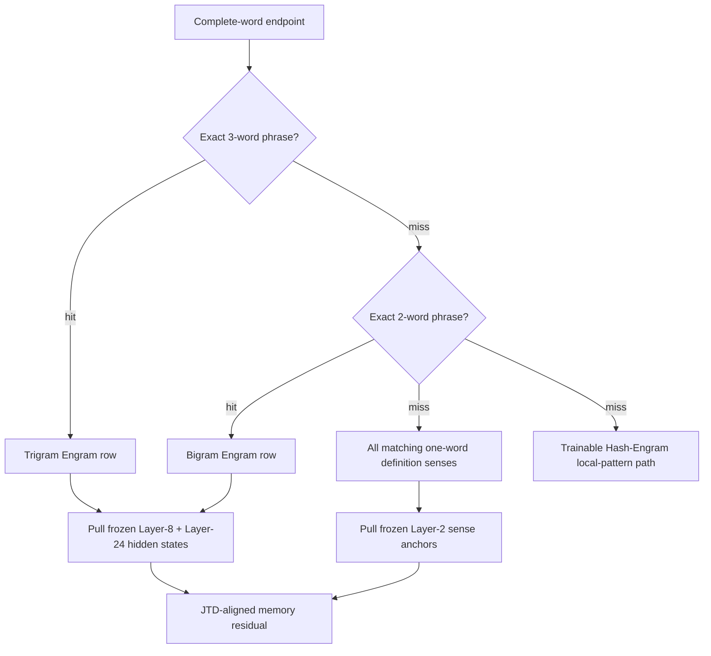
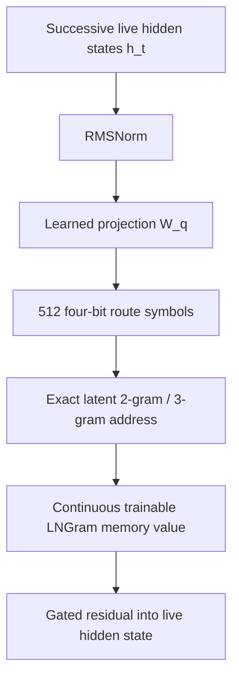
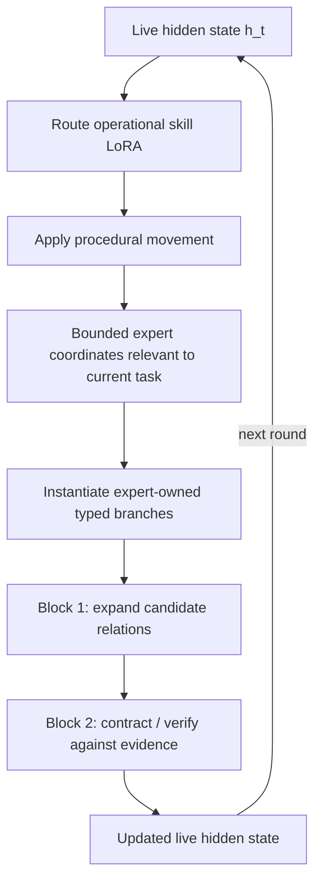

# Dendritron Recurrent Engram

> **Sparse memory. Procedural skills. Recurrent geometric reasoning.**

A CPU/ARM-first architecture built from exact Engram memory, a broad frozen definition bank, composed skill LoRAs, high-dimensional expert coordinates, signed HarMax geometry, LNGram latent lookup, and two recurrent physical blocks.

---

## Contents

1. [Architecture summary](#architecture-summary)
2. [Memory — what is stored](#memory--what-is-stored)
3. [Phrase Engrams — exact lookup tables](#phrase-engrams--exact-lookup-tables)
4. [Definition memory — broad English sense bank](#definition-memory--broad-english-sense-bank)
5. [Memory runtime — exact retrieval + JTD](#memory-runtime--exact-retrieval--jtd)
6. [Skill LoRAs — procedural movement](#skill-loras--procedural-movement)
7. [How the skill LoRAs will be made](#how-the-skill-loras-will-be-made)
8. [Shared / private / subspace geometry](#shared--private--subspace-geometry)
9. [Reasoning engine — live hidden state](#reasoning-engine--live-hidden-state)
10. [Experts + branches](#experts--branches)
11. [LNGram](#lngram)
12. [Harmonic Loss / HarMax](#harmonic-loss--harmax)
13. [DeepLoop](#deeploop)
14. [Research basis + evidence boundary](#research-basis--evidence-boundary)
15. [Repository map](#repository-map)
16. [Reproducing the structural checks](#reproducing-the-structural-checks)
17. [Mechanism lineage](#mechanism-lineage)

---

## Architecture summary

Dendritron separates three jobs that are normally mixed inside a deep Transformer:

| Capacity | Role |
|---|---|
| **Memory** | Exact bigram/trigram Engram tables and a frozen one-word definition bank |
| **Skills** | Operational LoRAs that encode reusable procedural movement |
| **Reasoning** | A live 2,048D hidden state repeatedly transformed by experts, branches, HarMax, LNGram, and DeepLoop |

---

## Memory — what is stored

### Phrase memory

Two exact Engram lookup tables store recurring two-word and three-word phrases. A phrase is the key. Its row contains two frozen 2,048D hidden-state representations: one from Qwen Layer 8 and one from Qwen Layer 24.

### Definition memory

A separate one-word dictionary bank stores one frozen 2,048D Layer-2 hidden state for every retained word sense, together with its exact definition, source identity, sense identity, and ordered definition-word links.

> Qwen is not part of runtime. Once built, the memory is the finished frozen tables plus their lookup indexes.

---

## Phrase Engrams — exact lookup tables

| Table | Rows | Exact key | Frozen row payload |
|---|---:|---|---|
| Bigram Engram | 500,000 | exact two-word phrase | Layer 8 `[2048]` BF16 + Layer 24 `[2048]` BF16 |
| Trigram Engram | 500,000 | exact three-word phrase | Layer 8 `[2048]` BF16 + Layer 24 `[2048]` BF16 |

```text
exact phrase inventory
→ offline Qwen pass
→ final non-padding token
→ hidden_states[8]  [2048]
→ hidden_states[24] [2048]
→ freeze exact Engram row
```

Runtime:

```text
exact phrase
→ exact Engram table row
→ {Layer-8 hidden state, Layer-24 hidden state}
```

---

## Definition memory — broad English sense bank

The dictionary was built broadly first. Coverage against the phrase Engrams was checked afterward.

| Source | Role |
|---|---|
| Open English WordNet Plus 2025+ | general English senses and polysemy |
| English Wiktionary / Wiktextract 2026-07-06 | broad lexical, scientific, and mathematical vocabulary |
| MeSH 2026 descriptors | biomedical and life-science terminology |
| MeSH 2026 supplementary concepts | chemicals, diseases, organisms, protocols, and emerging terms |

```text
retained external word/sense identity
+ exact source definition
→ withhold target headword from Qwen input
→ definition text + fixed readout marker
→ Qwen hidden_states[2]
→ freeze Layer-2 [2048] sense row
→ retain identity/provenance externally
```

After the broad dictionary existed, every unique word in the completed bigram/trigram Engram keys was checked against it. The audit verified coverage; it did not define the dictionary.

---

## Memory runtime — exact retrieval + JTD

```text
exact 3-word Engram
else exact 2-word Engram
else all matching 1-word definition senses
```

The Layer-2 definition geometry is the common 2,048D reference frame. Separate learned maps align phrase Layer-8, phrase Layer-24, and the live recipient hidden state with that frame:

$$
J_8(e^{(8)}), \qquad
J_{24}(e^{(24)}), \qquad
J_h(h), \qquad
\text{definition Layer-2} = I
$$

Integer row IDs are lookup handles. JTD is continuous alignment, not addressing.

---

## Skill LoRAs — procedural movement

Skills encode **how reasoning proceeds**, not the final answer. Candidate operational skills include:

`COMPARE` · `RETRIEVE` · `REVERSE` · `DERIVE` · `VERIFY` · `DECOMPOSE` · `SEQUENCE` · `COMPOSE`

The same operation should remain useful when the domain and final answer change.

---

## How the skill LoRAs will be made

The proposed training path uses human-authored reasoning checkpoints as direct supervision.

1. **Teach one operation at a time.** Train the same procedural move across unrelated domains.
2. **Freeze everything except the selected skill.** Base weights, memory, experts, other skills, and shared structure stay fixed.
3. **Train movement, not wording.** Match the skill-induced hidden-state movement to the next teacher-authored reasoning checkpoint.
4. **Use wrong → corrected paths as training pairs.** Failed continuation = negative direction; corrected continuation = positive direction.
5. **Verify before commit.** Save episode deltas, run held-out and replay tests, reject or roll back bad updates.
6. **Discover shared structure only after real skills exist.** Stack successful real `ΔW` updates and analyze recurring covariance with SVD/HOSVD.

$$
d_{\text{target}}=\operatorname{stopgrad}(h_{\text{next}}-h_{\text{current}})
$$

$$
d_{\text{skill}}=h_{\text{with skill}}-h_{\text{without skill}}
$$

$$
L_{\text{dir}}=1-\cos(d_{\text{skill}},d_{\text{target}})
$$

---

## Shared / private / subspace geometry

Successful operational skill LoRAs are collected first. Recurring cross-skill covariance becomes an **oblique shared LoRA**. Each skill keeps its measured private residual.

$$
\Delta W_{s,b}
=
B_b^{sh}\operatorname{diag}(q_s)A_b^{sh}
+
B_{s,b}^{priv}A_{s,b}^{priv}
$$

The retained **16–32 principled directions** are compact coordinates for reusable shared procedural structure. They are not complete skills.

---

## Reasoning engine — live hidden state

Dendritron's working representation is an evolving **2,048D hidden state** \(h_t\). Frozen Engram and definition rows remain stored values. The live state carries current context, intermediate conclusions, procedural movement, and memory effects through repeated visits.

---

## Experts + branches

Experts are **high-dimensional answer-bearing coordinates** formed from verified specialized structure that is not well represented by the compact procedural skill geometry.

During consolidation, the expert span is protected first. The lower-dimensional skill geometry is then adjusted around it using stable QR/SVD/null-space projection rather than literal classical Gram-Schmidt.

| Branch operator | Role |
|---|---|
| Deductive | premises → conclusion |
| Causal | cause / mechanism / effect |
| Contrastive | separate competing candidates |
| Counterfactual | change one condition and compare |
| Abductive | rank explanations for an observation |
| Compositional / analogical | transfer a relation into another domain |

---

## LNGram

LNGram exists for the **continuous recurrent trajectory**.

```text
successive h_t [2048]
→ RMSNorm
→ W_q
→ 512 × 4 hard bits
→ symbols in {0…15}
→ exact latent 2g / 3g address
→ continuous latent-memory value
```

$$
\operatorname{addr}^{(n)}
=
r\,16^n
+
\sum_j
\operatorname{symbol}(t-n+1+j,r)\,16^j
$$

The address is discrete and deterministic for a given bit sequence. The payload is a continuous trainable latent-memory value.

---

## Harmonic Loss / HarMax

For a bounded candidate pool:

$$
D_q=\|u-c_q\|^2+\text{bounded auxiliary terms}
$$

$$
p_q=\frac{D_q^{-n/2}}{\sum_j D_j^{-n/2}}
$$

$$
\rho=-\sum_q y_q\log p_q
$$

$$
\Delta u
=
n\sum_q
(y_q-p_q)
\frac{c_q-u}{D_q}
$$

- **\(y_q > p_q\)**: attraction toward underrepresented support.
- **\(y_q < p_q\)**: repulsion from excess-proximity competitors.

---

## DeepLoop

Dendritron stores **two ordered physical blocks** and reuses them for \(R\) rounds.

$$
H^{(r,1)}
=
\Phi_1(H^{(r,0)},\text{memory},\text{LNGram},\text{routing})
$$

$$
H^{(r+1,0)}
=
\Phi_2(H^{(r,1)},\text{memory},\text{LNGram},\text{routing})
$$

| Block | Bias |
|---|---|
| **Block 1 — Expansion** | retrieve, associate, propose |
| **Block 2 — Contraction** | contrast, verify, integrate |

Stored block depth remains **2** while the sequential unrolled thought depth is **\(2R\)**.

DeepLoop scaling:

$$
K=2,\qquad N=2R,\qquad M=4R
$$

$$
M\kappa_R\left(\frac{\beta}{\alpha}\right)^2=O(1)
$$

$$
\alpha=\sqrt{4R}=2\sqrt R
$$

$$
\beta=\frac{1}{\sqrt{16R}}=\frac{1}{4\sqrt R}
$$

---


## Architecture flow diagrams

### Surface memory



A phrase hit uses the exact phrase Engram at that endpoint. Constituent senses are **not** automatically injected underneath that phrase hit.

### LNGram latent memory



LNGram addresses its own latent memory from the recurrent hidden-state trajectory. It does not route into the dictionary-sense table.

### Skills, experts, branches, and recurrence



The skill supplies procedural movement. Expert coordinates carry specialized answer structure; branches bind that structure to the current reasoning state during the recurrent visit.


## Research basis + evidence boundary

The memory assets and JTD fits are real completed/reported artifacts. Several training and consolidation pieces — including the human-directed directional skill objective, oblique shared-LoRA extraction, and expert-coordinate formation — remain proposed experiments until measured on real Dendritron trajectories.


## Repository map

| Path | Purpose |
|---|---|
| [`modal_extract_states.py`](modal_extract_states.py) | Offline extraction of the exact bigram/trigram Engram rows and their frozen Layer-8 / Layer-24 hidden states |
| [`dendritron/engram_store.py`](dendritron/engram_store.py) | Resolves an exact phrase row into its frozen Layer-8 and Layer-24 tensors |
| [`dendritron/retrieval.py`](dendritron/retrieval.py) | Exact longest-match surface routing: trigram → bigram → one-word definition senses |
| [`dendritron/jtd.py`](dendritron/jtd.py) | Collision-safe surface-memory index and exact-address metadata |
| [`dendritron/joint_transfer.py`](dendritron/joint_transfer.py) | JTD maps for Layer-8, Layer-24, live hidden states, and joint-to-live movement |
| [`dendritron/lngram.py`](dendritron/lngram.py) | Original LNGram hidden-state discretization, exact latent 2/3-gram addressing, and continuous latent-memory tables |
| [`dendritron/lngram_address.py`](dendritron/lngram_address.py) | Reference implementation of the original LNGram address arithmetic |
| [`dendritron/definition_bank.py`](dendritron/definition_bank.py) | One-row-per-sense definition schema, source identity, and ordered definition-word metadata |
| [`dendritron/definition_store.py`](dendritron/definition_store.py) | Sparse retrieval of frozen Layer-2 definition-sense hidden states |
| [`dendritron/memory_fusion.py`](dendritron/memory_fusion.py) | JTD-aligned phrase / definition memory residual fusion and gating |
| [`dendritron/geometric_attention.py`](dendritron/geometric_attention.py) | HarMax proximity mass, Harmonic Loss residual, and signed Euclidean movement |
| [`dendritron/recurrent_core.py`](dendritron/recurrent_core.py) | Two physical recurrent blocks, repeated rounds, and DeepLoop residual structure |
| [`dendritron/working_adapter.py`](dendritron/working_adapter.py) | Current composed-LoRA / skill-adapter scaffold |
| [`dendritron/shared_skill_subspace.py`](dendritron/shared_skill_subspace.py) | Shared-skill/subspace fitting and consolidation scaffold |
| [`dendritron/universal_subspace.py`](dendritron/universal_subspace.py) | Earlier universal-subspace utilities retained in the repository |
| [`dendritron/expert_graph.py`](dendritron/expert_graph.py) | Skill-to-expert adjacency and expert-registry scaffolding |
| [`dendritron/capacity.py`](dendritron/capacity.py) | Sparse-capacity accounting utilities |
| [`dendritron/model.py`](dendritron/model.py) | Top-level model assembly |
| [`dendritron/output_geometry.py`](dendritron/output_geometry.py) | Softmax-free output geometry and vocabulary scoring |

The repository still contains historical scaffolding from earlier architecture iterations. The current architecture brief and current handoff take precedence over stale comments or older routing code.

## Reproducing the structural checks

```bash
python -m unittest discover -v
python smoke_cpu_core.py
python train_tiny_dendritron.py
python stage6_lngram/lngram_smoke.py
```

Large frozen memory assets are referenced through manifests. Synthetic fixtures are useful for local structural tests; claims about production memory behavior require the real built assets.

## Mechanism lineage

| Research source | Mechanism or evidence used in Dendritron | Role |
|---|---|---|
| [Harmonic Loss Trains Interpretable AI Models](https://arxiv.org/abs/2502.01628) | Euclidean HarMax mass, harmonic residual, signed derivative field | Runtime geometry |
| [DeepLoop: Depth Scaling for Looped Transformers](https://arxiv.org/abs/2607.13491) | Repeated tied-block visits, visit alignment, and conservative \(p=1/2\) residual scaling | Recurrent scaling |
| [Conditional Memory via Scalable Lookup](https://arxiv.org/abs/2601.07372) | Exact conditional memory, canonical token projection, bounded sparse lookup | Phrase-memory foundation |
| [Memory Grafting](https://arxiv.org/abs/2605.20948) | Frozen hidden-state values extracted offline and stored behind exact phrase lookup | Phrase-memory foundation |
| [Lngram: N-gram Conditional Memory in Latent Space](https://arxiv.org/abs/2605.24869) | Hidden-state discretization and exact latent 2/3-gram addresses | Latent memory |
| [Locality Preserving Joint Transfer](https://arxiv.org/abs/1906.07441) | Source-specific maps into a shared locality-preserving frame | Continuous alignment |
| [Shared LoRA Subspaces for Almost Strict Continual Learning](https://arxiv.org/abs/2602.06043) | Shared factors, lightweight coordinates, private residuals, consolidation | Skill decomposition |
| [User as Engram](https://arxiv.org/abs/2606.19172) | Separation of sparse content memory from shared reasoning structure | Design support |
| [A Collision-Free Hot-Tier Extension for Engram-Style Conditional Memory](https://arxiv.org/abs/2601.16531) | Collision and gate-credit diagnostics for Engram-style memory | Evaluation support |
| [Bilevel Optimization for Neural Architecture Search](https://arxiv.org/abs/2606.29582) | Offline selection framework for architecture/fitter hyperparameters | Training support |
| [Similarity-Guided Curriculum Fine-Tuning of LLMs for Neural Architecture Synthesis](https://arxiv.org/abs/2607.11591) | Similarity-banded curricula and interface-preservation checks | Training support |
| [Learning Faster without Deeper Networks: A*-Inspired Batch Selection](https://arxiv.org/abs/2607.15745) | Priority and reuse-penalty ideas for trajectory / replay scheduling | Training support |
| [Distinct Tasks Engage a Shared Neural Subspace in Human Hippocampus and Anterior Cingulate Cortex](https://doi.org/10.64898/2026.04.24.720703) | Motivation for reusable shared task structure | Scientific motivation |
| [A Shared Valence Axis Across Modern LLMs and Human EEG](https://arxiv.org/abs/2606.00129) | Shared-axis and saturation diagnostics | Scientific motivation |
| [From Directions to Cones: Multidimensional Representations of Propositional Facts](https://arxiv.org/abs/2505.21800) | Multidimensional concept-direction hypotheses and probes | Geometry support |
| [A Geometric Unification of Concept Learning with Concept Cones](https://arxiv.org/abs/2512.07355) | Cone-containment and alignment metrics | Geometry support |
| [Extinction Depth and q-ary Error-Correcting Codes for the Limited Permutation Channel](https://arxiv.org/abs/2607.19566) | Finite-horizon inspiration for future route-collision certification | Future verification |

---

**Dendritron Recurrent Engram synthesis and integration — Ryan Carson**
