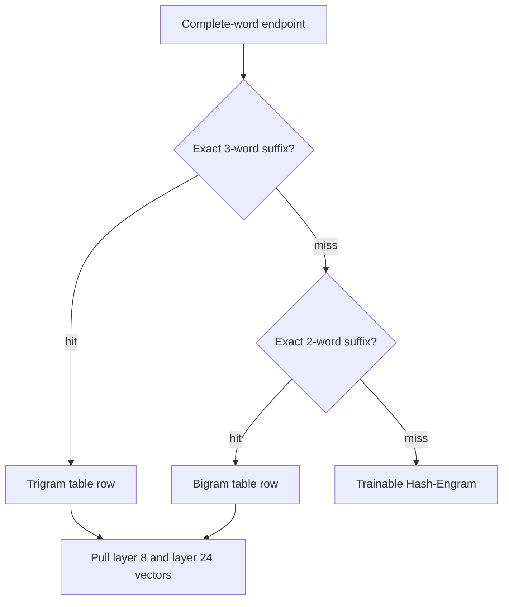
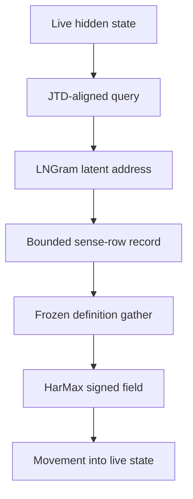
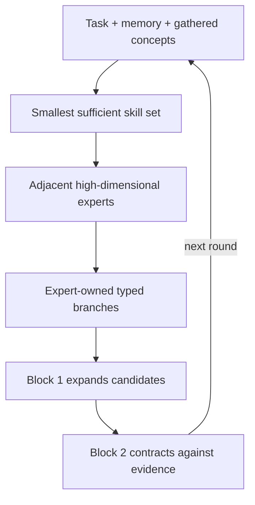

# Dendritron Recurrent Engram

<p align="center">
  <a href="docs/Dendritron_ARM_Technical_Architecture_Brief.pdf">
    
  </a>
</p>

<p align="center">
  <strong><a href="docs/Dendritron_ARM_Technical_Architecture_Brief.pdf">Read the Revision 4.1 technical architecture brief</a></strong><br>
  Two frozen phrase tables · layer-2 definition geometry · HarMax reasoning · shared LoRA skills · expert-owned branches · two-block DeepLoop
</p>

> **Stage 4 status — 16 August 2026:** punctuation-v2 phrase banks, token
> seeds, the layer-2 definition bank, real CPU JTD fits, and the two-block
> reference core are built or reported complete. The active development tree
> reports 176 tests. LNGram address-to-sense population and definition-pool
> evidence construction remain the current integration boundary.

## Why this architecture exists

Dendritron moves learned knowledge out of repeated dense computation and into
sparse, addressable memory. A large Qwen donor performs the expensive semantic
encoding once, offline. The live recipient retrieves only the rows needed for
the current text and carries its changing thought through two recurrent
physical blocks on CPU/ARM.

The design has one primary systems objective:

> **Use an NVIDIA-class GPU once to construct frozen knowledge assets; run and
> train the live Dendritron through CPU/ARM memory lookup, Euclidean geometric
> control, low-rank skills, sparse experts, and two reused blocks.**

The architecture separates stable knowledge from changing thought:

- **Memory is the stable reference.** Exact phrase states and definition-sense
  locations preserve knowledge already learned by the donor.
- **Reasoning is the changing region.** HarMax fields, skills, experts,
  branches, and recurrent updates transform the current thought.
- **The sparse-capacity law is fixed at 25% memory and 75% conditional
  compute.** The ratio comes from the architecture's paired amplitudes `0.5`
  and `sqrt(3)/2`, whose squared magnitudes are `0.25` and `0.75`, together
  with the intended one-to-three relation between stable reference and active
  transformation.

The DeepSeek Engram work motivates static lookup as a separate sparsity axis,
and Memory Grafting shows that frozen donor hidden states can become the values
inside an exact n-gram memory. Dendritron extends that idea with two donor
depths, a definition-concept geometry, latent LNGram addressing, signed
HarMax/Harmonic Loss control, reusable LoRA skills, expert-owned reasoning
branches, and a two-block recurrent engine.

Research basis: [Conditional Memory via Scalable Lookup](https://arxiv.org/abs/2601.07372),
[Memory Grafting](https://arxiv.org/abs/2605.20948), and
[Harmonic Loss Trains Interpretable AI Models](https://arxiv.org/abs/2502.01628).

## The core memory mechanism: two separate Engram tables

The frozen phrase memory consists of **two independent tables**. They have
separate row numbers, indexes, shards, and manifests.

| Frozen table | Rows | Exact key | Payload in every row |
|---|---:|---|---|
| Trigram Engram | 500,000 | One exact three-word phrase | UTF-8 phrase, frequency, `layer08[2048]` BF16, `layer24[2048]` BF16 |
| Bigram Engram | 500,000 | One exact two-word phrase | UTF-8 phrase, frequency, `layer08[2048]` BF16, `layer24[2048]` BF16 |

Each phrase was sent to the donor by itself. The stored values are the donor's
hidden states at the final non-padding subtoken of that phrase:

```text
isolated phrase
  -> one Qwen forward pass
  -> final non-padding subtoken
  -> hidden_states[8]  = 2,048-dimensional BF16 vector
  -> hidden_states[24] = 2,048-dimensional BF16 vector
  -> write both vectors into that phrase's table row
```

The phrase text and IDs serve as addresses and trace metadata. The semantic
content resides in the two hidden-state vectors.

### Why two hidden-state depths are stored

| Donor state | Intended role | Live use |
|---|---|---|
| Layer 8 | Earlier lexical and compositional construction | Gives the recipient useful phrase structure before and during early recurrent processing |
| Layer 24 | Deeper composed phrase meaning | Enters the later contraction path after the live state has acquired context |

Layer 8 and layer 24 preserve two useful stages of representation that the
smaller recipient can reinterpret through its own recurrent process. The live
width remains 2,048D so each donor row enters at full semantic width.

## Exact lookup and hidden-state retrieval

Lookup happens at every complete-word endpoint. The router checks the longest
surface phrase first:

```text
1. Build the exact three-word suffix ending here.
2. Query the trigram index.
3. On a hit, receive (bank="trigrams", row_index=i).
4. On a miss, build the exact two-word suffix.
5. Query the bigram index.
6. On a hit, receive (bank="bigrams", row_index=j).
7. On an exact phrase miss, activate the trainable Hash-Engram path.
```

The returned row pointer then pulls both frozen vectors:

```text
bank name + row index
  -> locate immutable Safetensors shard
  -> compute local row inside the shard
  -> load layer08[local_row]
  -> load layer24[local_row]
  -> verify phrase mask and source trace
```

This is an address lookup followed by a frozen payload read. Live execution
reuses the donor states directly.



Example: when the current text ends in `Alexander the Great`, an exact
trigram hit selects one row from the trigram table and pulls that row's layer-8
and layer-24 vectors. The bigram table remains a separate fallback address
space. Lower-order rows may also be exposed for decomposition experiments,
while the default injection follows longest-match priority.

Punctuation stays in the live Qwen token stream. Frozen phrase lookup uses
complete-word boundaries: `tree bark,` can retrieve `tree bark`, while a comma
between the words starts a new phrase segment. Internal apostrophes and hyphens
remain within their words.

Research basis: Memory Grafting supplies frozen final-token donor values and
longest exact suffix lookup; DeepSeek Engram supplies deterministic conditional
memory and hash-based miss coverage. Dendritron's extension is the separate
500k/500k word-phrase inventory with two donor depths per row.

## What happens to the two retrieved vectors

The selected phrase row produces two live payloads:

```text
layer-8 phrase vector
  -> JTD layer-8 map J8
  -> layer-2 joint concept frame
  -> projected movement into the initial and early recurrent state

layer-24 phrase vector
  -> JTD layer-24 map J24
  -> the same layer-2 joint concept frame
  -> projected movement into Block 2's later contraction path
```

The current reference code injects the layer-8 view at initialization and on
recurrent visits. It exposes the layer-24 view in physical Block 2. Small
trainable gates begin near zero so the recipient learns how strongly to use
each frozen donor view.

Relevant files:

- [`dendritron/retrieval.py`](dendritron/retrieval.py): longest `3 -> 2 -> 1` routing.
- [`dendritron/jtd.py`](dendritron/jtd.py): exact surface indexes and collision verification.
- [`dendritron/engram_store.py`](dendritron/engram_store.py): row-to-shard loading of both vectors.
- [`dendritron/memory_fusion.py`](dendritron/memory_fusion.py): JTD transfer, gating, and staged injection.

## The separate concept route: LNGram, JTD, and layer-2 definitions

Phrase lookup answers: **Which stored phrase occurred?**

Concept lookup answers: **Which meanings and relations are relevant in the
current context?**

The definition bank is a third frozen asset, separate from both phrase tables.
Each dictionary sense owns one Qwen layer-2 vector plus exact source metadata
and ordered links to the words in its definition.

| Definition field | Function |
|---|---|
| `layer02[2048]` | Fixed concept location |
| word ID and sense ID | Lookup and trace pointers |
| exact definition | Source record |
| ordered definition-word IDs | Graph links showing how the definition is constructed |

The live concept resolver is:

```text
evolving hidden state h_t
  -> J_h alignment into the frozen layer-2 frame
  -> RMSNorm and LNGram projection
  -> exact latent 2/3-gram address
  -> populated bounded sense-row record

surface phrase + constituent word senses
  -> exact sense seeds
  -> bounded related-anchor expansion
  -> frozen layer-2 definition gather

aligned live query + gathered definition anchors
  -> Euclidean distance field
  -> HarMax proximity mass p and target evidence y
  -> signed joint-space movement Delta u
  -> joint_to_live residual into h_t
```

LNGram makes the concept address repeatable from the continuous hidden state.
JTD aligns unlike vector sources into the same concept geometry while every
layer-2 definition vector keeps its original donor location. For a polysemous
word such as `bark`, the tree sense and dog sense remain separate points in the
gathered pool; current context and evidence assign their attraction or
repulsion through HarMax.



Words, token IDs, sense IDs, and definition-word IDs remain outside the vector
coordinates. They locate and explain the retrieved points; the points form the
learned concept geometry.

Research basis: [Lngram](https://arxiv.org/abs/2605.24869) supplies hidden-state
discretization and exact latent n-gram lookup. [Locality Preserving Joint
Transfer](https://arxiv.org/abs/1906.07441) supplies separate source mappings
into a neighborhood-preserving shared frame. Dendritron fixes Qwen layer-2
definition senses as the frame and connects LNGram's bounded address record to
the HarMax contraction pool.

### Current implementation boundary for concept resolution

The repository contains LNGram lookup, separate JTD maps for layer 8, layer 24,
and the live state, complete definition-bank attachment, supplied-sense-row
gathering, and Euclidean definition weighting. Two active contracts complete
the bridge:

- **O-019:** populate exact LNGram address records with bounded sense-row
  handles, masks, evidence metadata, and provenance.
- **O-021:** construct normalized target evidence `y` for the gathered
  definition pool and connect the complete signed derivative field.

## Geometric attention, HarMax, and Harmonic Loss

The aligned live query and every gathered anchor enter ordinary Euclidean
geometry. Let `u` be the normalized JTD-aligned live point and `c_q` a normalized
candidate anchor:

```text
D_q     = ||u - c_q||_2^2 + lambda_p * delta_q^2 + epsilon^2
p_q     = D_q^(-n/2) / sum_j D_j^(-n/2)
y_q     = normalized positive supported evidence
rho     = -sum_q y_q * log(p_q)
Delta u = n * sum_q (y_q - p_q) * (c_q - u) / D_q
```

HarMax itself assigns inverse-distance probability mass `p`. The harmonic
residual `rho` compares that mass with evidence target mass `y`. Its negative
gradient supplies the signed movement `Delta u`.

The coefficient `gamma_q = y_q - p_q` gives every anchor an explicit role:

- `gamma_q > 0` attracts the live point toward underrepresented support.
- `gamma_q < 0` repels it from contradictory or excess proximity.
- zero-target competitors remain in the denominator and provide contrast.

Uniform scaling of the completed distance vector cancels inside HarMax. The
causal displacement and epsilon terms therefore participate in the same
normalized distance construction. The Harmonic Loss paper's finite-center,
generalization, and interpretability results supply research motivation and
evaluation targets. Dendritron retains the mass, residual, and derivative as a
recurrent geometric control operator.

The same Euclidean contract governs definition scoring, branch contraction,
route evaluation, and tied vocabulary ranking. Bilinear runtime operator
count: `0`.

Implementation owner:
[`dendritron/geometric_attention.py`](dendritron/geometric_attention.py).

## Universal subspace, shared LoRA skills, and experts

These are three different forms of capacity.

| Level | Geometry | Purpose |
|---|---|---|
| Universal subspace | Target range of 16–32 principal directions in low-rank weight-update space | Common transformation structure found across successful adapters |
| Shared LoRA skills | Learnable low-rank adapters built on and beyond the universal directions | Reusable operations such as comparison, causal analysis, retrieval control, or mathematical manipulation |
| Experts | High-dimensional conditional modules outside the low-rank basis | Specialized knowledge/task/skill junctions that own reasoning branches |

The universal subspace is the common procedural coordinate system. A skill is
an actual learnable adapter operating in that system. An expert is a larger
specialist selected through skill adjacency. This separation keeps common
operations compact while preserving high-dimensional capacity for specialized
work.

For skill `s` and physical block `b`, the complete adapter is:

```text
Delta W_s,b = B_b^sh diag(q_s) A_b^sh + B_s,b^priv A_s,b^priv
```

- `A_b^sh` and `B_b^sh` are block-specific shared factors.
- `q_s` spans the full shared basis and preserves skill identity across blocks.
- `A_s,b^priv` and `B_s,b^priv` preserve specialized update energy for that
  skill and block.
- `skill_to_experts` supplies a bounded expert candidate set; concept evidence
  ranks that set.

The geometric router seeks the smallest sufficient set of skills for the
current task. Selected skill IDs open a bounded neighborhood of adjacent
experts, so the global comparison remains small even as the expert library
grows.

Research basis: [Shared LoRA Subspaces for Almost Strict Continual
Learning](https://arxiv.org/abs/2602.06043) supports a continually refined
foundational adapter subspace and compact task coefficients. Dendritron treats
those reusable adapters as skills and places high-dimensional experts beyond
the shared low-rank foundation.

### Procedural SVD/HOSVD compiler

Semantic JTD fitting and procedural subspace fitting remain separate. Verified
reasoning trajectories form the procedural stack:

```text
D_proc = Stack({Delta h_t, Delta o_t, vec(Delta W_t), J_t}_verified)
D_proc = U Sigma V^T
x      = (I - U U^T) delta
```

SVD or HOSVD supplies the candidate fitter. Retained rank follows measured
cumulative energy, reconstruction error, task success, and replay preservation.
The target range is 16–32 shared procedural directions, with the measured fit
deciding the populated rank.

Leading modes propose shared skill slots and router anchors. Orthogonal
residual energy `x` remains attached to the selected skill's private factors
and verified experience. Repeated coherent residuals may later enter a new
shared-basis consolidation cycle.

Implementation owners:
[`dendritron/working_adapter.py`](dendritron/working_adapter.py) and
[`dendritron/shared_skill_subspace.py`](dendritron/shared_skill_subspace.py).

## How user learning becomes LoRA Engram memory

Learning happens in stages:

```text
1. Route the task through a small set of shared skill LoRAs.
2. Fit temporary user/episode coefficients and a permitted residual skill update.
3. Record concept IDs, skills, experts, branch outcome, and success evidence.
4. Commit a successful trace to the user's experience Engram tier.
5. Reuse that trace as a prior when the same concept-task neighborhood returns.
6. During consolidation, absorb recurring residual structure into an existing skill
   or add a new orthogonal direction when evidence supports a genuinely new skill.
```

The experience Engram preserves personal, local adaptation. Shared skills
preserve operations that repeatedly generalize. The universal subspace changes
more slowly through verified consolidation. This provides continual learning
while keeping active updates sparse and low rank.

Runtime task execution keeps the core, shared basis, skill coefficients,
private factors, routers, and experts frozen. Successful trajectories enter a
detached offline working buffer; replay, regression, provenance, and version
checks precede each canonical commit.

Research basis: [User as Engram](https://arxiv.org/abs/2606.19172) motivates
the separation of sparse personal content from shared reasoning skill.

## Task → skill → expert → branch → DeepLoop

A task is the current relation to solve, such as proving a conclusion,
comparing two claims, explaining a cause, or constructing a counterfactual.
The task combines with retrieved concept evidence to activate shared skills.
Those skills restrict expert selection. Each selected expert owns its own
candidate reasoning branches.



An expert junction binds knowledge, task, skill, branch, prior, and success
statistics. Each branch specification carries its operator, relation, semantic
roles, skill mask, evidence signs, and exact anchor IDs.

| Branch | Core operation |
|---|---|
| Deductive | Bind premises and test whether a candidate conclusion is jointly supported |
| Causal | Bind cause, mechanism, and effect under causal-order constraints |
| Contrastive | Preserve the dimensions that distinguish competing candidates |
| Counterfactual | Change one bound condition and propagate the resulting differences |
| Abductive | Rank candidate explanations against observed evidence and contradictions |
| Compositional / analogical | Transfer a relation structure between concept neighborhoods |

Every branch returns derivative movement, a harmonic residual, signed evidence,
confidence, exact memory/source pointers, and an auditable trace. The expert
soma combines branch movements through signed L1-normalized weights.

Implementation owner:
[`dendritron/expert_graph.py`](dendritron/expert_graph.py).

### Where the two-block DeepLoop sits

DeepLoop wraps the entire active hierarchy.

- **Physical Block 1 expands.** It opens relevant skills, experts, relations,
  semantic anchors, and candidate branches.
- **Physical Block 2 contracts.** It compares candidates with retrieved memory,
  opposing anchors, causal visibility, and branch evidence.
- **The resulting hidden state returns to Block 1.** Each round reuses the same
  two stored blocks, giving effective depth `2R` for `R` rounds.

Each physical block has two sequential Post-RMSNorm residual sublayers:

```text
C     = Delta_HarMax-context + Delta_memory + Delta_branch-contract
U     = RMSNorm(alpha * H_in + C)
E     = Delta_skill-LoRA + Delta_expert-soma
H_out = RMSNorm(alpha * U + E)
```

The hidden state carries the thought from round to round. Engram rows remain
stable anchors. Skills, experts, branches, and harmonic evidence determine how
the thought moves relative to those anchors.

[DeepLoop](https://arxiv.org/abs/2607.13491) supplies visit-aware scaling for
reused parameters. For `K = 2`, `N = KR = 2R`, and two residual sublayers per
block, `M = 2KR = 4R`:

```text
alpha = sqrt(2N)
beta  = 1 / sqrt(8N)
stability diagnostic: M * kappa_R * (beta / alpha)^2 = O(1)
```

`kappa_R` measures alignment among repeated parameter visits and remains part
of the loop-stability evidence.

Implementation owner:
[`dendritron/recurrent_core.py`](dendritron/recurrent_core.py).

## The integrated recurrent step

Every visit binds memory and reasoning into one system:

```text
h_t
  -> JTD-aligned live query u_t
  -> surface phrase lookup + constituent sense seeds
  -> LNGram bounded definition address
  -> frozen phrase and definition gather
  -> Euclidean distances D_q
  -> HarMax mass p_q and target evidence y_q
  -> signed movement Delta u
  -> Block 1 expansion or Block 2 contraction
  -> composed shared/private skill LoRA
  -> bounded expert branches and expert soma
  -> h_t for the next recurrent visit
```

Memory supplies stable coordinates and source evidence. The active reasoning
engine supplies movement, procedural transformation, branch testing, and
recurrent integration.

## CPU/ARM execution model

The live architecture reduces GPU dependence through five linked choices:

1. Qwen hidden-state extraction is a one-time offline job.
2. Exact trigram and bigram lookup fetches only the selected rows.
3. Frozen tables can reside in CPU memory, memory-mapped storage, or an NVMe
   hierarchy with deterministic prefetch.
4. Two physical blocks are reused for additional reasoning depth.
5. Skills are low-rank and experts activate sparsely.

The PyTorch code is the semantic reference implementation. The production path
targets packed BF16/INT8 memory, quantized linear kernels, vectorized Euclidean
distance, and ARM-aware sparse row fetch.

| Capacity region | Share | Contents |
|---|---:|---|
| Stable sparse memory | 25% | Exact phrase Engrams, definition senses, experience records, and immutable addressing assets |
| Conditional computation | 75% | HarMax fields, recurrent blocks, LoRA skills, sparse experts, branches, and decoding |

## What exists today

Status on 16 August 2026:

| Subsystem | Status |
|---|---|
| Punctuation-v2 bigram and trigram inventories | Complete |
| Corrected phrase banks | 809,775 exact-identity rows copied + 190,225 freshly extracted = 1,000,000 rows complete |
| Separate layer-8/layer-24 payloads for both phrase tables | Complete in the external immutable donor banks |
| Qwen token seed matrix | `248,077 x 2,048` BF16 export complete |
| Definition bank | `1,532,746 x 2,048` BF16 layer-2 rows across 31 shards, reported complete |
| JTD anchor triples | 32,768 bigrams + 32,768 trigrams complete |
| Real CPU JTD fits | `J8: 21.849 -> 0.372`; `J24: 37.923 -> 0.844` complete |
| Longest trigram → bigram → dictionary resolver | Implemented |
| Row pointer → shard → layer-8/layer-24 payload loading | Implemented |
| Definition-bank attachment and supplied-sense-row gather | Reported complete |
| Two-block HarMax recurrent core and tied Euclidean vocabulary output | CPU verified |
| Composed LoRA, expert, transition, and provenance tree | 176 tests reported |
| LNGram address → populated bounded sense-row record | Current integration under O-019 |
| Definition-pool target evidence and complete signed field | Current integration under O-021 |
| Typed branch executors, language training, and optimized ARM measurements | Experimental and engineering milestones |

`Complete`, `CPU verified`, `reported`, `current integration`, and `milestone`
preserve distinct evidence levels.

## External assets omitted from GitHub

| Asset | Contract |
|---|---|
| Bigram donor bank | 500,000 rows; two 2,048D BF16 vectors per row; about 4.096 GB raw vector payload |
| Trigram donor bank | 500,000 rows; two 2,048D BF16 vectors per row; about 4.096 GB raw vector payload |
| Definition bank | 1,532,746 layer-2 BF16 sense vectors plus source graph and row-aligned shards |
| Token seed matrix | 248,077 Qwen input-embedding vectors at 2,048D BF16 |
| Surface indexes | Exact trigram, bigram, and dictionary addresses with row pointers and fingerprints |
| JTD checkpoint | Layer-8, layer-24, live-to-joint, and joint-to-live maps |
| Procedural directions | Per-block shared factors, skill coefficients, private residual factors, and consolidation report |

Every external asset carries its source fingerprint, tokenizer revision, shape,
dtype, row count, and SHA-256 manifest.

## Repository map

| Path | Purpose |
|---|---|
| [`modal_extract_states.py`](modal_extract_states.py) | Builds both 500k phrase tables and writes layer-8/layer-24 rows |
| [`dendritron/engram_store.py`](dendritron/engram_store.py) | Loads both hidden-state vectors from an exact phrase row |
| [`dendritron/retrieval.py`](dendritron/retrieval.py) | Longest trigram/bigram/dictionary routing |
| [`dendritron/jtd.py`](dendritron/jtd.py) | Collision-safe surface index |
| [`dendritron/joint_transfer.py`](dendritron/joint_transfer.py) | Layer-2 joint concept frame and joint-to-live movement |
| [`dendritron/lngram.py`](dendritron/lngram.py) | Hidden-state discretization and latent n-gram lookup |
| [`dendritron/memory_fusion.py`](dendritron/memory_fusion.py) | Staged donor-vector and definition injection |
| [`dendritron/geometric_attention.py`](dendritron/geometric_attention.py) | HarMax mass, harmonic residual, and signed Euclidean movement |
| [`dendritron/recurrent_core.py`](dendritron/recurrent_core.py) | Two physical blocks, repeated rounds, and DeepLoop scaling |
| [`dendritron/working_adapter.py`](dendritron/working_adapter.py) | Composed shared/private LoRA skills |
| [`dendritron/shared_skill_subspace.py`](dendritron/shared_skill_subspace.py) | Procedural-subspace fitting and consolidation utilities |
| [`dendritron/expert_graph.py`](dendritron/expert_graph.py) | Task/skill/expert/branch ownership records |
| [`dendritron/capacity.py`](dendritron/capacity.py) | Fixed 25/75 conditional-capacity ledger |

## Immediate implementation order

1. Complete O-019 address-to-sense assignment and populate bounded route
   records.
2. Lock O-021 evidence construction and connect the complete signed definition
   field.
3. Verify end-to-end phrase plus constituent-sense payload materialization.
4. Implement and measure one complete deductive expert branch with exact trace.
5. Extend the branch interface across causal, contrastive, counterfactual,
   abductive, and compositional/analogical operators.
6. Fit and validate the procedural skill basis, private residuals, and expert
   routing.
7. Train and measure language quality, memory utilization, loop convergence,
   CPU throughput, peak memory, and ARM performance.

## Reproducing the structural checks

```bash
python -m unittest discover -v
python smoke_cpu_core.py
python train_tiny_dendritron.py
python stage6_lngram/lngram_smoke.py
```

Large donor assets are referenced through manifests. Synthetic fixtures support
the repository-level structural suite.

## Mechanism lineage

The table distinguishes direct runtime foundations from supporting training,
evaluation, geometry, and scientific sources.

| Research source | Mechanism or evidence used in Dendritron | Role |
|---|---|---|
| [Harmonic Loss Trains Interpretable AI Models](https://arxiv.org/abs/2502.01628) | Euclidean HarMax mass, harmonic residual, signed derivative field; finite-center results motivate evaluation | Runtime foundation |
| [DeepLoop: Depth Scaling for Looped Transformers](https://arxiv.org/abs/2607.13491) | Two tied physical blocks, repeated visits, `kappa_R`, and conservative `p = 1/2` residual scaling | Runtime foundation |
| [Conditional Memory via Scalable Lookup](https://arxiv.org/abs/2601.07372) | Deterministic conditional memory, canonical token projection, bounded sparse lookup | Runtime foundation |
| [Memory Grafting](https://arxiv.org/abs/2605.20948) | Offline donor states, exact longest-suffix phrase memory, projection/gating, hash fallback | Runtime foundation |
| [Lngram: N-gram Conditional Memory in Latent Space](https://arxiv.org/abs/2605.24869) | Hidden-state discretization and exact latent 2/3-gram addressing | Runtime foundation |
| [Locality Preserving Joint Transfer](https://arxiv.org/abs/1906.07441) | Source-specific projections into a shared locality-preserving frame | Runtime foundation |
| [Shared LoRA Subspaces for Almost Strict Continual Learning](https://arxiv.org/abs/2602.06043) | Shared procedural factors, lightweight coefficients, private residuals, and consolidation | Runtime foundation |
| [User as Engram](https://arxiv.org/abs/2606.19172) | Separation of sparse content memory from shared reasoning skill | Design support |
| [A Collision-Free Hot-Tier Extension for Engram-Style Conditional Memory](https://arxiv.org/abs/2601.16531) | Route-stratified collision and gate-credit diagnostics for surface and Hash-Engram evaluation | Evaluation support |
| [Bilevel Optimization for Neural Architecture Search](https://arxiv.org/abs/2606.29582) | Offline selection framework for fitter, router, and consolidation hyperparameters | Training support |
| [Similarity-Guided Curriculum Fine-Tuning of LLMs for Neural Architecture Synthesis](https://arxiv.org/abs/2607.11591) | Similarity-banded offline curricula and interface-preservation checks | Training support |
| [Learning Faster without Deeper Networks: A*-Inspired Batch Selection](https://arxiv.org/abs/2607.15745) | Priority and reuse-penalty ideas for verified trajectory and replay scheduling | Training support |
| [Distinct Tasks Engage a Shared Neural Subspace in Human Hippocampus and Anterior Cingulate Cortex](https://doi.org/10.64898/2026.04.24.720703) | Empirical motivation for a stable shared procedural subspace across tasks | Scientific motivation |
| [A Shared Valence Axis Across Modern LLMs and Human EEG](https://arxiv.org/abs/2606.00129) | Shared-axis and saturation diagnostics for alignment and consolidation studies | Scientific motivation |
| [From Directions to Cones: Multidimensional Representations of Propositional Facts](https://arxiv.org/abs/2505.21800) | Multidimensional semantic-cone hypotheses, causal probes, and anchor-neighborhood evaluation | Geometry support |
| [A Geometric Unification of Concept Learning with Concept Cones](https://arxiv.org/abs/2512.07355) | Cone containment and alignment metrics for supervised and discovered semantic directions | Geometry support |
| [Extinction Depth and q-ary Error-Correcting Codes for the Limited Permutation Channel](https://arxiv.org/abs/2607.19566) | Finite-horizon inspiration for future route-collision certification | Future verification |
